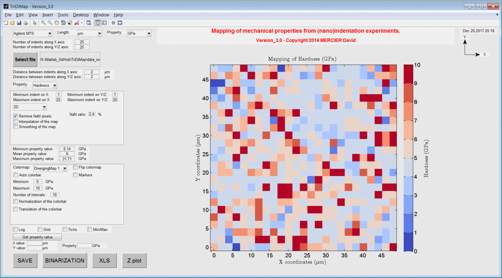

TriDiMap
=========
This Matlab toolbox has been developed to plot and to analyze mechanical properties maps from (nano)indentation results .

To get started with the TriDiMap toolbox, clone the repository, then run Matlab, and cd into the folder containing this README file.

You can start the launcher by typing "demo" at the Matlab command prompt.

Features
--------

The TriDiMap toolbox has been developed to plot, to map and to analyze (nano)indentation
dataset.

With this Matlab toolbox, it is possible:
    * to map (in 2D or 3D), to interpolate and to smooth indentation map;
    * to plot elastic modulus vs hardness values;
    * to plot and to fit probability density functions;
    * to plot and to fit cumulative density functions;
    * to extract statistical values (mean, min, max with standard deviations) of mechanical properties and fractions for each phase;
    * to correct mechanical map from image correlation with microstructural map;
    * to correlate/compare mechanical map with microstructural map;
    * to plot 4D mechanical property map.

Matlab version
------------------
Developed with Matlab R2014a.

Author
----------
Written by D. Mercier [1] (david.mercier@crmgroup.be / david9684@gmail.com).

[1] CRM Group, 4000 Liège, Belgium (`www.crmgroup.be <www.crmgroup.be>`_)

Reference papers
------------------

* `Mercier D. et al., "Mechanical characterization by nanoindentation of an electroplated nickel matrix composite coating" (2017). <https://dx.doi.org/10.1051/mattech/2017014>`_
* `Mercier D. et al., "Microstrucutral and mechanical characterization of electroplated nickel matrix composite coatings" (2018). <https://doi.org/10.1080/02670844.2018.1433270>`_

Keywords
---------
|matlab| toolbox; nanoindentation; mapping; grid; 2D; 3D; mechanical properties;
probability density function; deconvolution; multimodal Gaussian fit; cumulative density function; image correlation.

Contributors
-------------
- Pierre Huyghes (ULB, Bruxelles) and Antoine Hillhorst (UCL) contributed to the Matlab code.

Acknowledgements
-----------------
The author is grateful to `Dr. Jiri Nemecek <http://ksm.fsv.cvut.cz/~nemecek/?page=resume&lang=en>`_ from (`Czech Technical University <https://www.cvut.cz/en>`_, Czech Republic (Prague))
and to Dr. Nicholas Randall from (`Anton Paar <https://www.anton-paar.com>`_), for discussions and many advices about nanoindentation mapping.

The author is grateful to Debora Rossell (`OCAS <http://www.ocas.be/>`_, Belgium (Zwijnaarde)), for providing example files.

Screenshots
-------------

   
   *3D mapping of sample hardness obtained from indentation tests.*

.. figure:: ./_pictures/gif_4Dmap/25x25pixels_25slices.gif
   :scale: 50 %
   :align: center
   
   *4D mapping of sample hardness obtained from indentation tests (25x25 pixels x25 slices).*