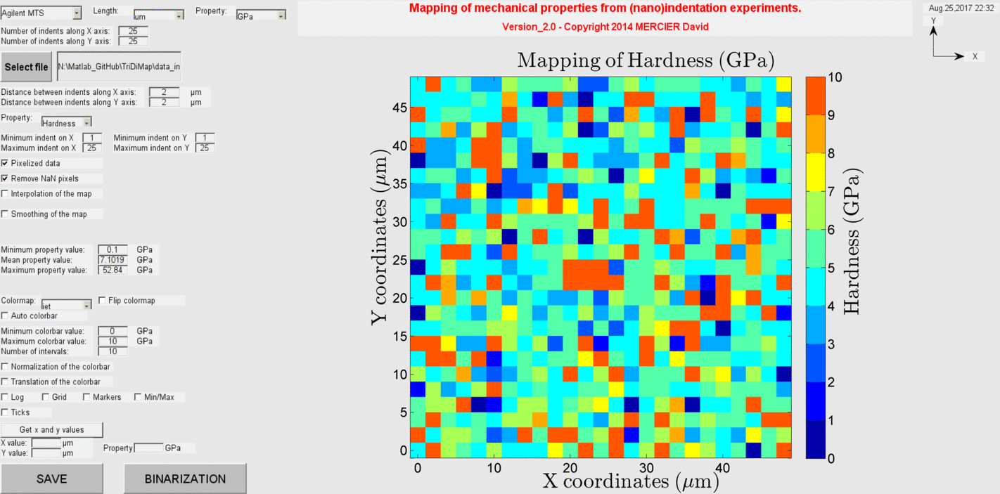

TriDiMap
=========
This Matlab toolbox has been developed to plot and to analyze mechanical properties maps from (nano)indentation results .

To get started with the TriDiMap toolbox, clone the repository, then run Matlab, and cd into the folder containing this README file.

You can start the launcher by typing "demo" at the Matlab command prompt.

Features
--------

This Matlab toolbox has been developed to :

- Plot mechanical properties maps ;

- Analyze statistically nanoindentation dataset.

Matlab version
------------------
Developed with Matlab R2014a.

Author
----------
Written by D. Mercier [1] (david.mercier@crmgroup.be / david9684@gmail.com).

[1] CRM Group, 4000 Liège, Belgium (`www.crmgroup.be <www.crmgroup.be>`_)

Reference papers
------------------

* `Mercier D. et al., "Mechanical characterization by nanoindentation of an electroplated nickel matrix composite coating" (2017). <http://dx.doi.org/10.1051/mattech/2017014>`_

Keywords
---------
Matlab script ; 3D mapping ; 2D projection ; elastic modulus ; hardness ; nanoindentation ; grid.

Contributors
-------------
- Pierre Huyghes (ULB, Bruxelles) contributed to the Matlab code.

Screenshots
-------------

   
   *3D mapping of sample hardness obtained from indentation tests.*