Matlab functions to plot 3D maps
=================================

Matlab version
------------------
Developed with Matlab R2014a.

Author
----------
Written by D. Mercier [1] (david.mercier@crmgroup.be / david9684@gmail.com).

[1] CRM Group, 4000 Liège, Belgium (`www.crmgroup.be <www.crmgroup.be>`_)

Keywords
---------
Matlab script ; 3D mapping ; 2D projection ; elastic modulus ; hardness ; nanoindentation ; grid.

How to use this Matlab toolbox
-------------------------------
1. Update the "demo.m" Matlab file:
	- path of your dataset ;
	- path of your images (optional)
	- set type of plot
	- set interpolation and smoothing steps ;
	- number of indents along X and Y axis ;
	- step size along X and Y axis ;
	- options of plots, colorscale...

2. Run into Matlab the script: demo.m.

3. Answer "yes" to the 1st question in the Command Window of Matlab, in order to add the above folder with subfolders to the matlab search path.

4. Finaly, maps of hardness and elastic modulus are plotted.

Contributors
-------------
- Pierre Huyghes (ULB, Bruxelles) contributed Matlab code.

Screenshots
-------------
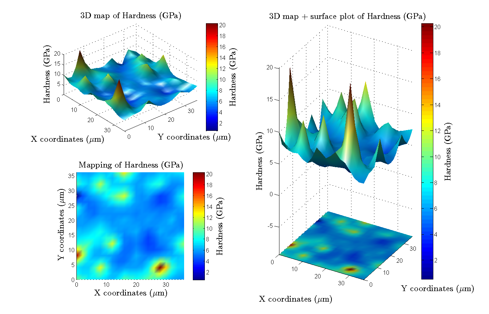
   
   *3D mappings of mechanical properties obtained from indentation tests with different views.*
   
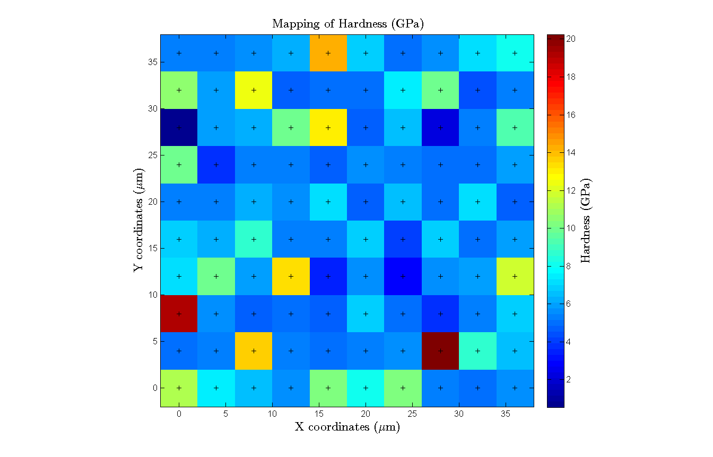
   
   *3D raw mapping of mechanical properties (pixel grid).*
   
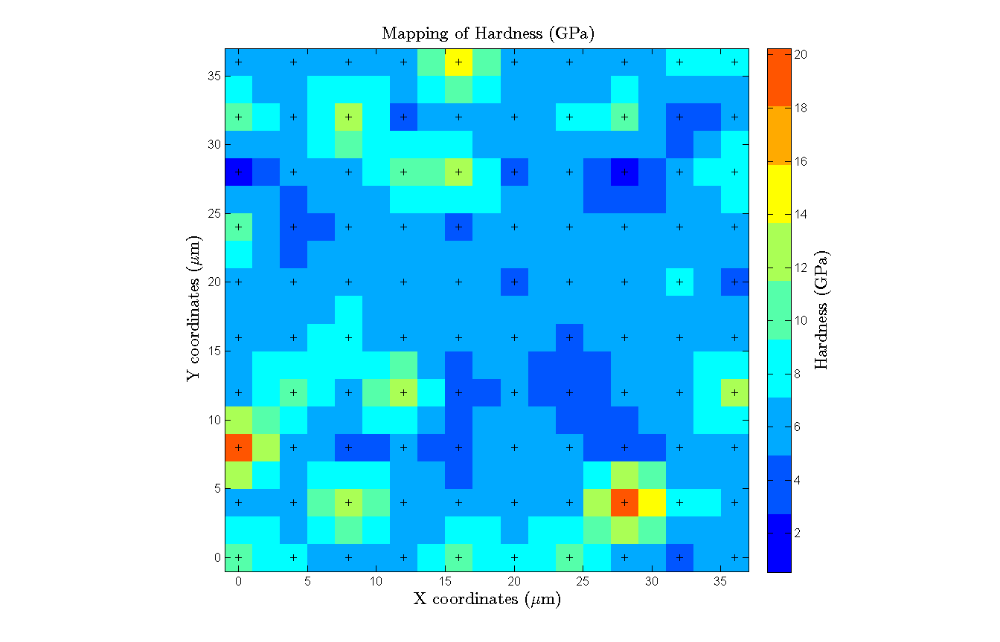
   
   *3D raw mapping of mechanical properties with interpolation (pixel grid).*

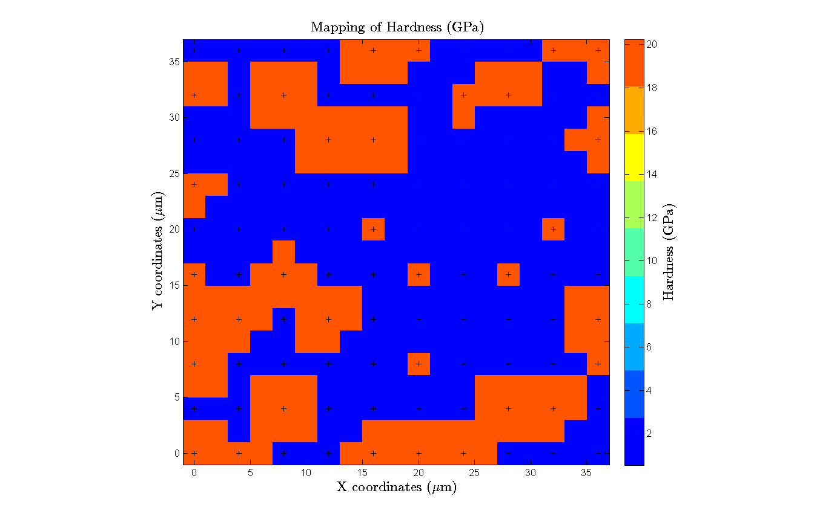
   
   *3D raw mapping of mechanical properties with interpolation and binarization (pixel grid).*   
   
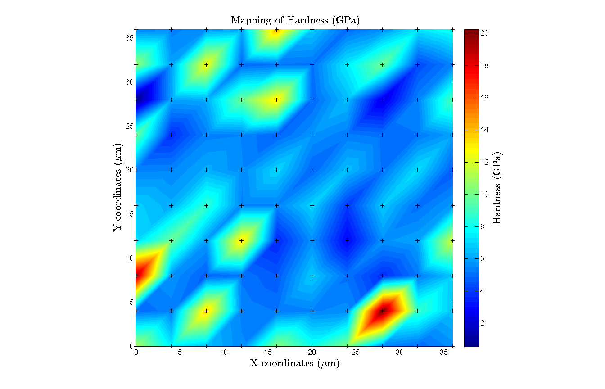
   
   *3D raw mapping of mechanical properties without interpolation and smoothing (surf function).*
   
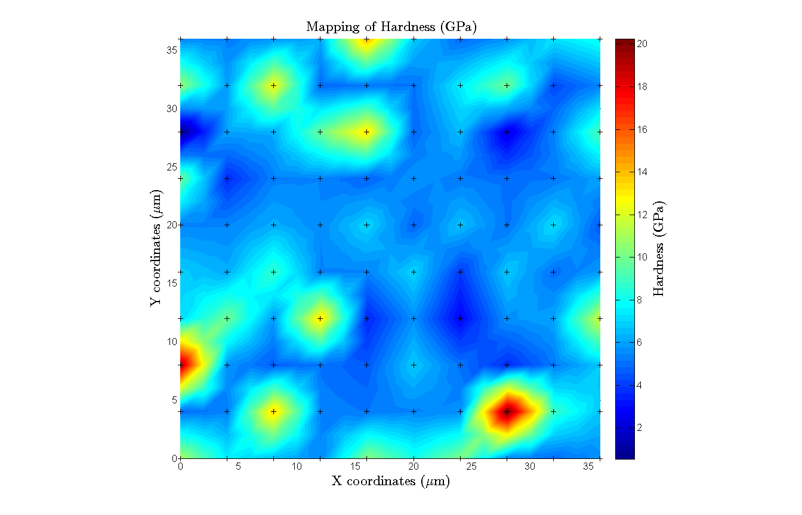
   
   *3D mapping of mechanical properties with interpolation and no smoothing (surf function).*

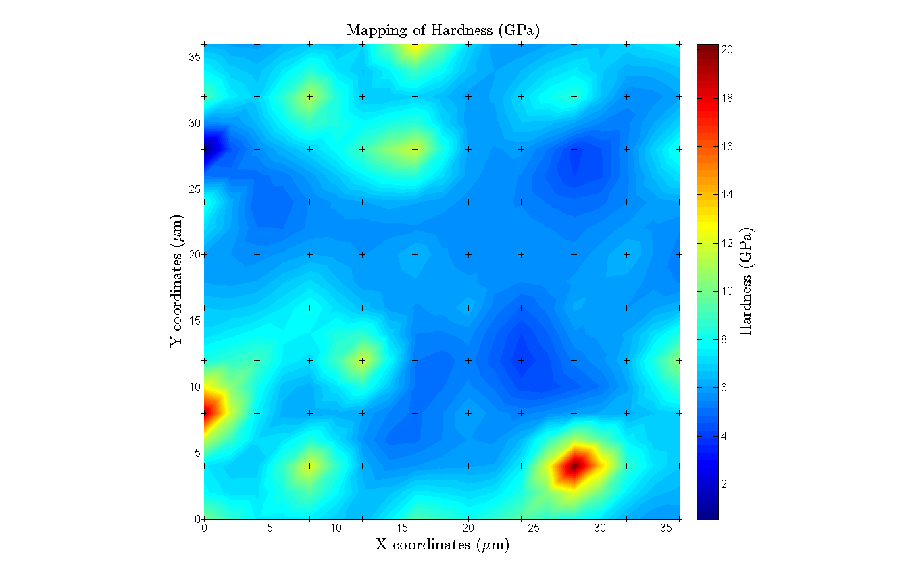
   
   *3D mapping of mechanical properties with interpolation and smoothing (surf function).*
   
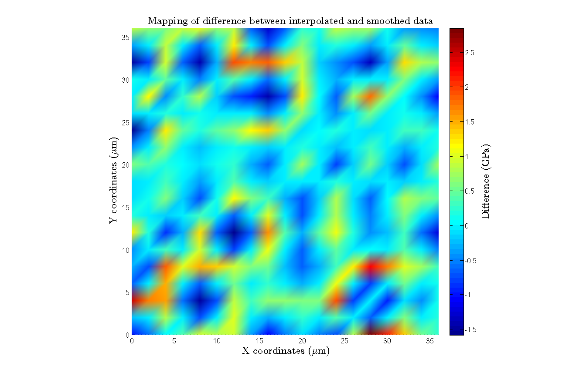
   
   *Difference map of mechanical properties between interpolated and smoothed data (surf function).*
   
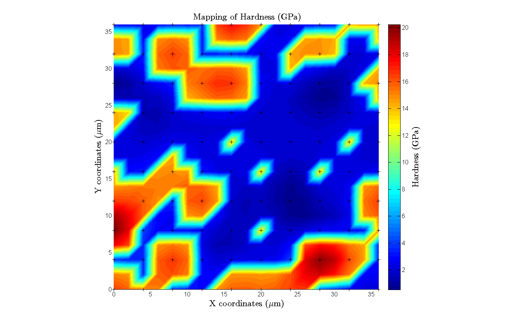
   
   *3D mapping of mechanical properties with interpolation, smoothing and binarization (surf function).*
   
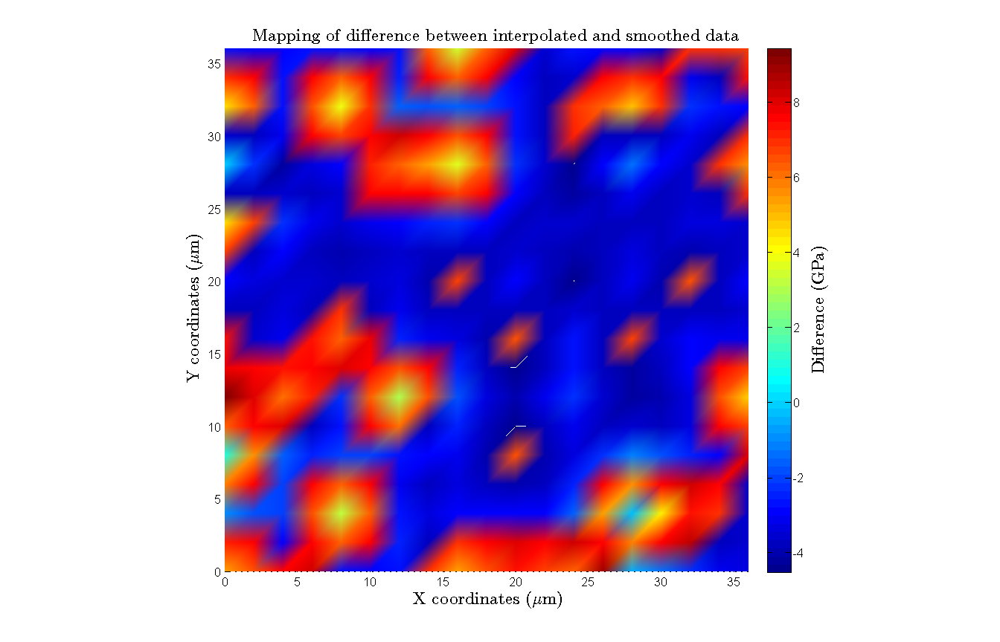
   
   *Difference map of mechanical properties between interpolated and smoothed/binarized data (surf function).*
   
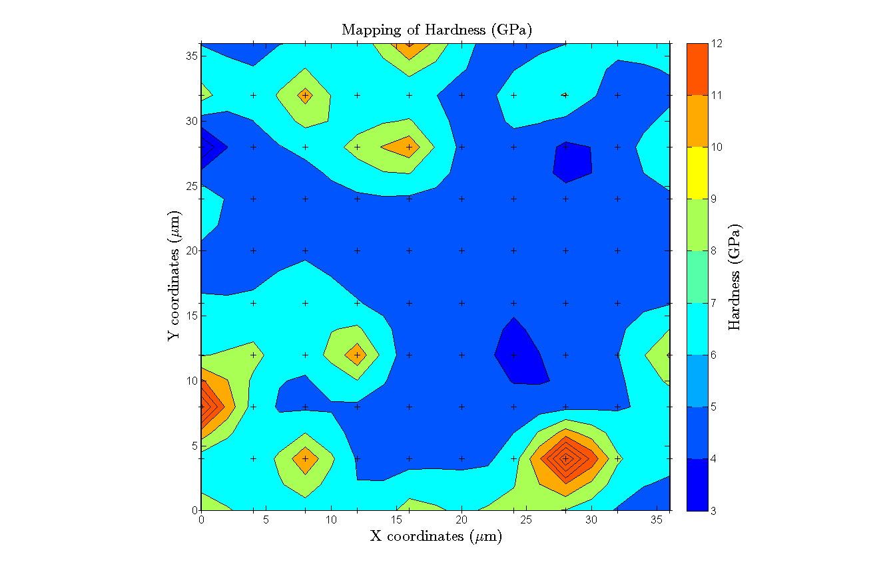
   
   *3D mapping of mechanical properties with interpolation, smoothing and with a discretized scale bar (surf function).*  