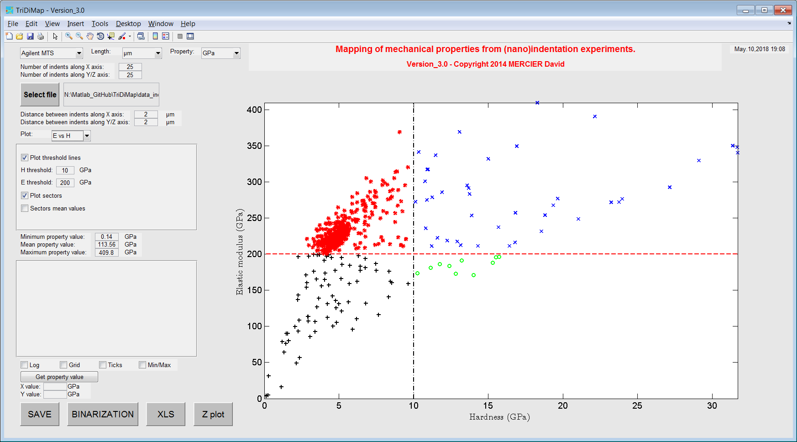
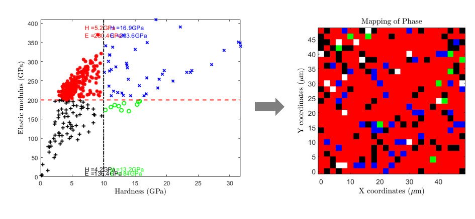

Elastic modulus vs Hardness plot
=================================

.. include:: includes.rst

Another way to visualize the distribution of mechanical property results is to plot for example
the elastic modulus values vs the hardness values. Such a plot leads sometimes to the observation of 
family of points and the definition of "sector" or "bubbles", corresponding to a given phase (e.g. soft matrix vs hard and stiff particles).

As a first analysis of such a plot, sectors can be defined by giving an average value of elastic modulus and
an average of hardness value, separating respectively by an horizontal line and a vertical line the different bubbles of points.
Each sector is defined by a unique color.

Finally, average values of mechanical properties are given for each sectors directly into the graph,
and a 4 color-coded map corresponding to this plot can be generated (see 2nd figure).

   
   *Example of sectorized elastic modulus vs hardness plot*
   

   
   *Sectorized elastic modulus vs hardness plot with mean values and corresponding mechanical map*