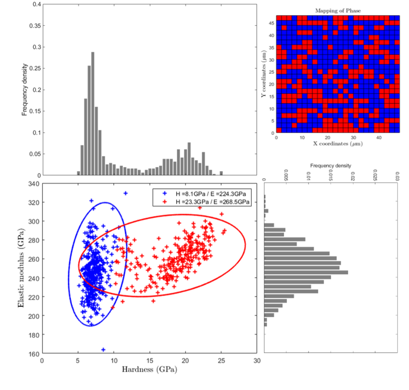

Elastic modulus vs Hardness plot
=================================

.. include:: includes.rst

Another way to visualize the distribution of mechanical property results is to plot for example
the elastic modulus (E) values vs the hardness (H) values. Such a plot leads sometimes to the observation of 
families of points and the definition of "sectors" or "bubbles",
each one corresponding to a single phase (e.g. soft matrix vs hard and stiff particles).

The correlation between elastic and plastic properties has been extensively studied in the literature
[#Gent_1958]_, [#Bao_2004]_, [#Oyen_2006]_ and [#Labonte_2017]_.

.. note::
    Elastic modulus is an intrinsic material property and hardness is an engineering property, which can be related to yield strength for some materials.

E-H map sectorization
############################################

As a first analysis of such a plot, sectors can be defined by giving an average value of elastic modulus and
an average of hardness value, separating respectively by an horizontal line
and a vertical line the different bubbles of points.
Each sector is defined by a unique color.

Finally, average values of mechanical properties are given for each sectors directly into the graph,
and a 4 color-coded map corresponding to this plot can be generated (see 2nd figure).

.. figure:: ./_pictures/MTS_example1_25x25_H_GUI_12.png
   :scale: 50 %
   :align: center
   
   *Example of sectorized elastic modulus vs hardness plot*
   
.. figure:: ./_pictures/sectorMap.png
   :scale: 50 %
   :align: center
   
   *Sectorized elastic modulus vs hardness plot with mean values and corresponding mechanical map*

Clustering with Gaussian Mixture Models
############################################

The Gaussian mixture Models (GMM) are often used for data clustering [#Wilson_2018]_. This method is well described 
in the |matlab| documentation [#Matlab_GMM]_, [#Matlab_cluster]_ and [#Matlab_clustering]_ but also in the literature [#Fraley_1998]_.

This method is powerful to separate contribution of 2 or 3 phases (especially in the case of a soft metallic matrix with hard ceramic particles) 
in the cloud of experimental points [#Hu_2005]_.
Average mechanical property values can also be extracted using this method and a 2 or 3 color map can be obtained too.

The |matlab| third party code used to define clusters GMM is: `GMMClustering.m <https://github.com/DavidMercier/TriDiMap/third_party_codes/GMMClustering/GMMClustering.m>`_

   
   *Elastic modulus vs hardness plot with clusters of points obtained with GMM*

Ashby map
############################################

Such plot could be seen as a conventional Ashby map [#Ashby_2005]_, with materials families.
An example of a typical Ashby map is given afterwards, using the CES Selector 2018 software [#CES_Selector]_.
At some point, it is possible to add material reference (bulk, homogeneous, monophasic, ...) values on the E-H map,
in order to compare experimental data with data from the literature.

.. figure:: ./_pictures/E-H_Ashby.png
   :scale: 50 %
   :align: center
   
   *Typical Ashby map of elastic modulus vs Vickers hardness, obtained using CES Selector software*
	
References
############################################

.. [#Ashby_2005] Ashby M.F., "Materials Selection in Mechanical Design" (2005), ISBN 978-0-7506-6168-3.
.. [#Bao_2004] `Bao Y.W. et al., "Investigation of the relationship between elastic modulus and hardness based on depth-sensing indentation measurements" (2004). <https://doi.org/110.1016/j.actamat.2004.08.002>`_
.. [#CES_Selector] `CES Selector 2018 <https://www.grantadesign.com/>`_
.. [#Fraley_1998] `Fraley C. and Raftery A.E., "How Many Clusters? Which Clustering Method? Answers Via Model-Based Cluster Analysis" (1998). <https://doi.org/10.1093/comjnl/41.8.578>`_
.. [#Gent_1958] `Gent A.N., "On the Relation between Indentation Hardness and Young's Modulus." (1958). <https://doi.org/10.5254/1.3542351>`_
.. [#Hu_2005] `Hu C., "Nanoindentation as a tool to measure and map mechanical properties of hardened cement pastes" (2005). <https://doi.org/10.1557/mrc.2015.3>`_
.. [#Labonte_2017] `Labonte D. et al., "On the relationship between indenation hardness and modulus, and the damage resistance of biological materials" (2017). <https://doi.org/10.1016/j.actbio.2017.05.034>`_
.. [#Matlab_GMM] `Mathworks - Gaussian Mixture Models <https://fr.mathworks.com/help/stats/gaussian-mixture-models-1.html>`_
.. [#Matlab_cluster] `Mathworks - Cluster <https://fr.mathworks.com/help/stats/gmdistribution.cluster.html>`_
.. [#Matlab_clustering] `Mathworks - Cluster Using Gaussian Mixture Models <https://fr.mathworks.com/help/stats/clustering-using-gaussian-mixture-models.html>`_
.. [#Oyen_2006] `Oyen M.L., "Nanoindentation hardness of mineralized tissues" (2006). <https://doi.org/10.1016/j.jbiomech.2005.09.011>`_
.. [#Wilson_2019] `Wilson W. et al., "Automated coupling of NanoIndentation and Quantitative EnergyDispersive Spectroscopy (NI-QEDS): A comprehensive method to disclose the micro-chemo-mechanical properties of cement pastes" (2018). <https://doi.org/10.1016/j.cemconres.2017.08.016>`_
