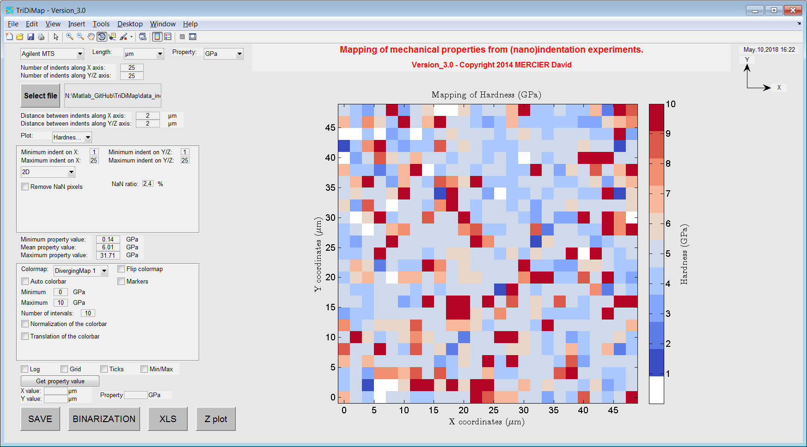

Getting started
================

.. include:: includes.rst

First of all, download the source code of the |matlab| toolbox.

`Source code is hosted at Github. <https://github.com/DavidMercier/TriDiMap>`_

  
How to use the GUI for indentation mapping?
####################################################

First of all a GUI is a Graphical User Interface.

* Run the following |matlab| script :

.. code-block:: matlab

   demo.m
   
* Answer 'y' or 'yes' (or press 'Enter') to add path to the |matlab| search paths, using this script:

.. code-block:: matlab

   path_management.m

* The following window opens:

.. figure:: ./_pictures/GUI_Main_Window.png
   :scale: 40 %
   :align: center
   
   *Screenshot of the main window of the TriDiMap toolbox.*

* Set your type of equipment and units for length and mechanical property.

* Import your (nano)indentation results, by clicking on the button 'Select file'.
  `Click here to have more details about valid format of data.
  <http://tridimap.readthedocs.org/en/latest/examples.html>`_

* Hardness map is plotted by default.

* It is possible to plot other maps, statistical distribution of mechanical properties (see 'Plot' menu).

   
   *Plot of the hardness map after loading of data.*

* It is possible to crop dataset, to set min/max values, to modify colorbar options...
   
Links
#######

* `Matlab GUI. <http://www.mathworks.com/discovery/matlab-gui.html>`_
