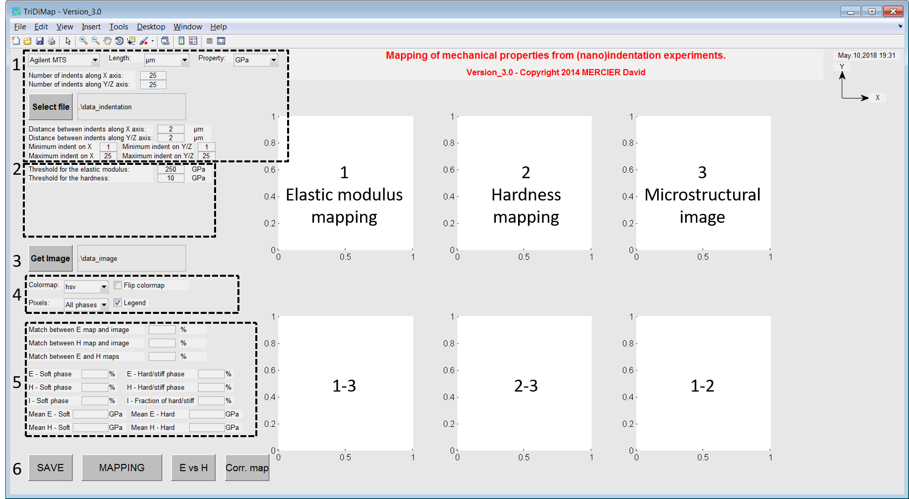

Getting started
================

.. include:: includes.rst

First of all, download the source code of the |matlab| toolbox.

`Source code is hosted at Github. <https://github.com/DavidMercier/TriDiMap>`_
  
How to use the GUI
####################################################

First of all a GUI is a Graphical User Interface.

* Run the following |matlab| script :

.. code-block:: matlab

   demo.m
   
* Answer 'y' or 'yes' (or press 'Enter') to add path to the |matlab| search paths, using this script:

.. code-block:: matlab

   path_management.m
   
* The following window opens:

.. figure:: ./_pictures/GUI_Main_Window.png
   :scale: 30 %
   :align: center
   
   *Screenshot of the main window of the TriDiMap toolbox*

Main GUI for the indentation mapping
####################################################

* The following window opens for indentation mapping:

   
   *Screenshot of the detailed main window of the TriDiMap toolbox*
   
* 1) Initial settings and indentation data loading
    - Set your type of equipment and units for length and mechanical property. Set 'Agilent' in case of .xls file generated using the TriDiMap GUI.
    - Set the number of indents along the X and the Y directions.
    - Import your (nano)indentation results, by clicking on the button 'Select file'. `Click here to have more details about valid format of data. <http://tridimap.readthedocs.org/en/latest/examples.html>`_
    - Distance between indents (along X and Y axis) should be automatically calculated, but it is sometimes wrong. In this case, the user has to set carefully (i.e. checking the length unit, it is in micron by default) by himself these 2 distances.

* 2) Plot settings
    - Set your type of equipment and units for length and mechanical property. Set 'Agilent' in case of .xls file generated using the TriDiMap GUI.
    - Hardness map is plotted by default.
    - It is possible `to modify (to crop, to smooth, to set other colorbar...) <https://tridimap.readthedocs.io/en/latest/map_options.html>`_ this map and to plot other 2D or 3D maps, and to obtain the statistical distribution of mechanical properties:
	  + `2D map <https://tridimap.readthedocs.io/en/latest/mapping.html>`_
	  + `3D / 4D map <https://tridimap.readthedocs.io/en/latest/tomography.html>`_
	  + `Statistical analysis <https://tridimap.readthedocs.io/en/latest/pdf_cdf.html>`_
	  + `Hardness vs Elastic modulus map <https://tridimap.readthedocs.io/en/latest/E_H.html>`_
	  + `Image correlation <https://tridimap.readthedocs.io/en/latest/image_correlation.html>`_

* 3) Average, minimum and maximum values are calculated
  
* 4) Plot options
    - Set the colormap
	- Set the colorbar (number of steps, log scale, normalization...)
	- Add markers, min/max values...

* 5) Get values from the map by clicking on a pixel.
	
* 6) Buttons to save data (screenshots, .xls file...), to open the 2nd GUI (maps correlation) or to quit...
	
Check the different file format possible to import in the TriDiMap toolbox: `File formats <https://tridimap.readthedocs.io/en/latest/examples.html>`_

.. figure:: ./_pictures/MTS_example1_25x25_H_GUI_00.png
   :scale: 40 %
   :align: center
   
   *Plot of the hardness map after loading of data*
   
..  note::
    X-Y axis is given on the top right of the GUI as a reference, to indicate the user how maps are read and plotted...
    
..  warning::
    Only square or rectangular indentation grids can be loaded into the Matlab toolbox.

Second GUI for the maps correlation
####################################################

* A second window opens for maps correlation, when user click on the 'BINARIZATION':

.. figure:: ./_pictures/GUI_Main_Window_2.png
   :scale: 30 %
   :align: center
   
   *Screenshot of the second window of the TriDiMap toolbox*

* It is always possible to go back to the main GUI, by clicking on the 'MAPPING' button.

   
   *Screenshot of the detailed second window of the TriDiMap toolbox*

* 1) Initial settings and indentation data loading (mechanical maps)
    - Set your type of equipment and units for length and mechanical property. Set 'Agilent' in case of .xls file generated using the TriDiMap GUI.
    - Set the number of indents along the X and the Y directions.
    - Import your (nano)indentation results, by clicking on the button 'Select file'. `Click here to have more details about valid format of data. <http://tridimap.readthedocs.org/en/latest/examples.html>`_
    - Distance between indents (along X and Y axis) should be automatically calculated, but it is sometimes wrong. In this case, the user has to set carefully (i.e. checking the length unit, it is in micron by default) by himself these 2 distances.

* 2) Threshold definition to separate soft phase from hard/stiff phase

* 3) Microstructural map loading

* 4) Maps options (colormap...)

* 5) Statistical calculations for each map (mean values, phases ratio...)

* 6) Buttons to save data (screenshots, .xls file...), to open the 1st GUI (indentation mapping) or to quit...

Links
#######

* `Matlab GUI <http://www.mathworks.com/discovery/matlab-gui.html>`_
* `Other links and references <https://tridimap.readthedocs.io/en/latest/links_ref.html>`_
