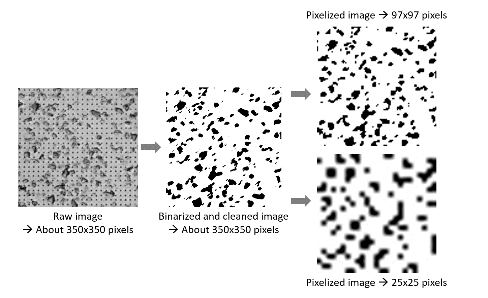
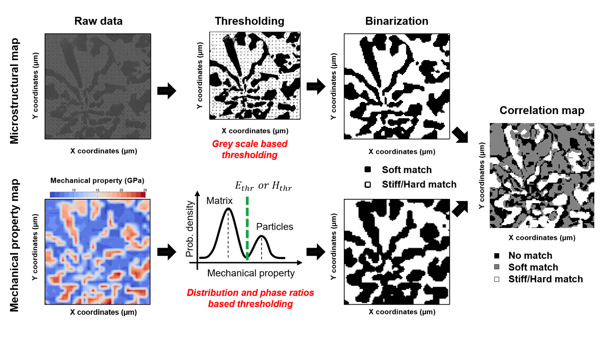

Image correlation
==========================

.. include:: includes.rst

Loading and analyzing/comparing binary maps
############################################

First, mechanical maps generated using indentation experiments have to be loaded.
These maps are automatically binarized, applying a threshold (mean hardness and mean elastic modulus values by default).
These thresholds can be modified or optimized later by comparing phase ratio determined from the microstructural map.
Afterwards, a binarized microstructural map has to be loaded, with the same resolution as the mechanical maps (e.g. 25x25 pixels in the following examples).
A solution to avoid pixelized maps is to apply linear interpolation on the mechanical map and thus increasing the mechanical maps resolution.

To obtain a pixelized microstructural map, a solution is to use the software ImageJ (or Fiji) [#ImageJ_software]_.
Once an image of the indentation grid is obtained by microscopy with enough quality (good contrast between phases, enough resolution...), load it in the image analysis software.
Crop the image around the indentation grid and let the minimum of space around the matrix of imprints.
Adjust the contrast/brightness of the image to emphasize the different phases in your sample.
Then, adjust the number of pixels horizontally and vertically, before to save it as a .png microstructural map.

Examples of microstructural maps:
`data_image <https://github.com/DavidMercier/TriDiMap/tree/master/data_image>`_ 

.. note::
    It is much better to obtain the microstructural image before the indentation experiments. Otherwise, residual indents affect the image quality and thus some additional operations of cleaning are required (e.g. despeckle, FFT, ...).
	

   
   *Example of image processing of the microstructural map*   

   
   *Vizualization of binarized mechanical maps*
   
.. figure:: ./_pictures/MTS_example1_25x25_H_GUI_18.png
   :scale: 40 %
   :align: center
   
   *Comparison between binarized microstructural map and mechanical maps*
   
.. figure:: ./_pictures/MTS_example1_25x25_H_GUI_19.png
   :scale: 40 %
   :align: center
   
   *Phase ratio optimized comparison between binarized microstructural map and mechanical maps*
   
Image Correlation Based Targeted Indentation (ICBTI)
############################################

Phase fractions and mechanical property values can be extracted from grid nanoindentation experiments
using innovative and quantitative statistical treatments of datasets,
with image correlation based targeted indentation (ICBTI) analysis.
The concept of the ICBTI is explained in different papers [#Mercier_2017]_, [#Mercier1_2018]_ and [#Mercier2_2018]_.

The microstructural map thresholding is based on greyscale distribution of the micrograph,
while for the mechanical property maps thresholding is based on the phase distribution.
For mechanical property map, threshold values are obtained by finding the intermediate value between matrix and particle peaks,
while respecting phase ratios obtained from microscopical image analysis.
After thresholding and binarization operations,
the difference between binarized mechanical property and microstructural maps is computed and plotted so as to create correlation maps.
This procedure is described graphically in the following figures.
Mechanical property–microstructure correlation maps allow assessing the match between indents
and the probed phase in order to select indents representative for each single phase.
Then, the intersection between these two mechanical properties–microstructure
correlation maps gives a new correlation map without measurements artefacts.
Such abnormal measurements may come from the presence of a defect (void, crack, surface pollution,etc.)
or from the detection of an underlying or very small particle.

Cleaned E-H plots are generated by clicking on the button 'E vs H' at the bottom left of the GUI.
Correlation maps are obtained by clicking on the button 'Corr. Map' at the bottom left of the GUI.

For the cleaned E-H plot, it is asked to add material reference (bulk, homogeneous, monophasic, ...),
in order to compare experimental data with reference data.

   
   *Principle of the ICBTI analysis, for a Ni-SiC sample*
   

   
   *Principle of the ICBTI analysis, for a steel with carbides (flower) sample*
   

   
   *Scheme of different indentation tests (cross-sectional view) and mathematical criteria,for discrimination between correct measurements and artefacts in the correlation process during the ICTBI analysis*
   

   
   *Cleaned E-h plot*
   
References
############################################

.. [#ImageJ_software] `ImageJ <https://imagej.nih.gov/ij/>`_
.. [#Mercier_2017] `Mercier D. et al., "Mechanical characterization by nanoindentation of an electroplated nickel matrix composite coating" (2017). <https://dx.doi.org/10.1051/mattech/2017014>`_
.. [#Mercier1_2018] `Mercier D. et al., "Microstructural and mechanical characterization of electroplated nickel matrix composite coatings" (2018). <https://doi.org/10.1080/02670844.2018.1433270>`_
.. [#Mercier2_2018] `Mercier D. et al., "Mechanical properties mapping of cast bimetallic work roll shell material by nanoindentation" (2018). <https://doi.org/10.13140/RG.2.2.35449.16482/1>`_