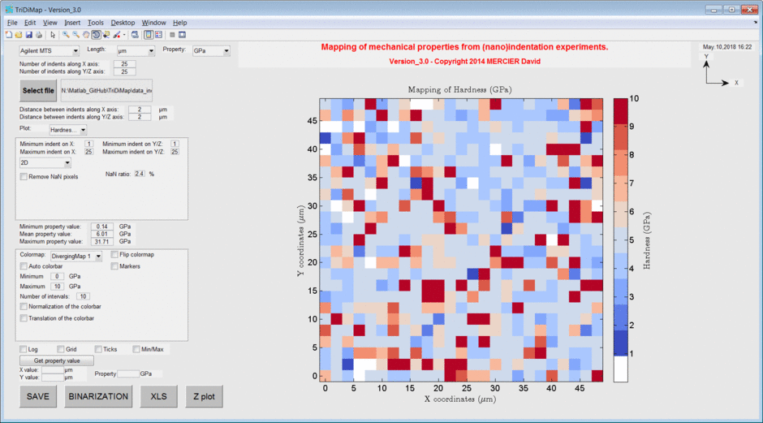

.. Matlab documentation master file, created by
   sphinx-quickstart on Fri Apr 04 20:28:37 2014.
   You can adapt this file completely to your liking, but it should at least
   contain the root `toctree` directive.
   
.. include:: includes.rst
   
TriDiMap |matlab| toolbox
==============================

.. figure:: ./_pictures/icon_tridimap.png
    :scale: 40 %
    :align: right
	
Determination of the mechanical properties of each individual phase in
the case of a multiphase, heterogeneous or composite material can be
achieved using the grid nanoindentation technique [#Constantinides_2006]_,
[#Němeček_2009]_ and [#Randall_2009]_.

The TriDiMap toolbox has been developed to plot, to map and to analyze
(nano)indentation dataset.

With this Matlab toolbox, it is possible:
    * to map (in 2D or 3D), to interpolate and to smooth indentation map;
    * to plot elastic modulus vs hardness values;
    * to plot and to fit probability density functions;
    * to plot and to fit cumulative density functions;
    * to extract statistical values (mean, min, max with standard deviations) of mechanical properties and fractions for each phase;
    * to correct mechanical map from image correlation with microstructural map;
    * to correlate/compare mechanical map with microstructural map;
    * to plot 4D mechanical property map.

`Source code is hosted at Github <https://github.com/DavidMercier/TriDiMap>`_.

.. figure:: ./_pictures/normal_folder.png
   :scale: 4 %
   :align: left
   :target: https://github.com/DavidMercier/TriDiMap/archive/tridimap.zip
   
`Download source code as a .zip file <https://github.com/DavidMercier/TriDiMap/archive/master.zip>`_.

.. figure:: ./_pictures/normal_folder.png
   :scale: 4 %
   :align: left
   :target: https://media.readthedocs.org/pdf/tridimap/latest/tridimap.pdf
   
`Download the documentation as a pdf file <https://media.readthedocs.org/pdf/tridimap/latest/tridimap.pdf>`_.
   

   
   *Screenshot of the TriDiMap toolbox.*

Contents
==========
   
.. toctree::
   :maxdepth: 3
   
   getting_started
   mapping
   tomography
   pdf_cdf
   E_H
   image_correlation
   examples
   links_ref
   
Author
----------
:Author: `David Mercier <david9684@gmail.com>`_ [1]

[1] `CRM Group, Avenue du Bois Saint-Jean 21, B27 – Quartier Polytech 4, 4000 Liège, Belgium <http://www.crmgroup.be/>`_

Reference papers
------------------

* `Mercier D. et al., "Mechanical characterization by nanoindentation of an electroplated nickel matrix composite coating" (2017). <https://dx.doi.org/10.1051/mattech/2017014>`_
* `Mercier D. et al., "Microstrucutral and mechanical characterization of electroplated nickel matrix composite coatings" (2018). <https://doi.org/10.1080/02670844.2018.1433270>`_

Keywords
---------
|matlab| toolbox; nanoindentation; mapping; grid; 2D; 3D; mechanical properties;
probability density function; deconvolution; multimodal Gaussian fit; cumulative density function; image correlation.

Contributors
-------------
- Pierre Huyghes (ULB, Bruxelles) and Antoine Hillhorst (UCL, Louvain-La-Neuve) contributed to the Matlab code.

Acknowledgements
-----------------
The author is grateful to `Dr. Jiri Nemecek <http://ksm.fsv.cvut.cz/~nemecek/?page=resume&lang=en>`_ from `Czech Technical University <https://www.cvut.cz/en>`_, Czech Republic (Prague)
and to Dr. Nicholas Randall from `Anton Paar <https://www.anton-paar.com>`_, for discussions and many advices about nanoindentation mapping.

The author is grateful to Debora Rossell (`OCAS <http://www.ocas.be/>`_, Belgium (Zwijnaarde)), for providing example files.

The author is grateful to Jean-François Vanhumbeeck (`CRM Group <www.crmgroup.be>`_, Belgium (Liège)), for fruitful discussion and co-authoring of reference papers.

Screenshots
-------------

.. figure:: ./_pictures/gif_4Dmap/25x25pixels_25slices.gif
   :scale: 50 %
   :align: center
   
   *4D mapping of sample hardness obtained from indentation tests (25x25 pixels x25 slices).*

References
-------------
.. [#Constantinides_2006] `Constantinides G. et al., "Grid indentation analysis of composite microstructure and mechanics: Principles and validation." (2006). <https://doi.org/10.1016/j.msea.2006.05.125>`_
.. [#Němeček_2009] `Němeček J., "Nanoindentation of heterogeneous structural materials.", PhD thesis (2009). <http://ksm.fsv.cvut.cz/~nemecek/teaching/dmpo/literatura/habilitation%20thesis_Nemecek_CTU-01-2010.pdf>`_
.. [#Randall_2009] `Randall N.X. et al., "Nanoindentation analysis as a two-dimensional tool for mapping the mechanical properties of complex surfaces." (2009). <https://doi.org/10.1557/jmr.2009.0149>`_
