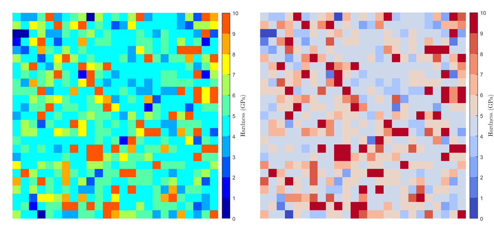
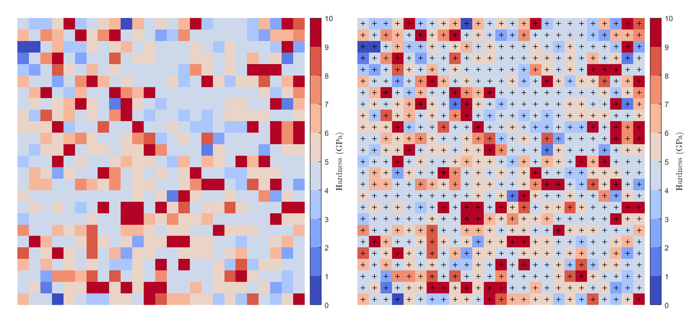

Mapping options
==========================

.. include:: includes.rst

Crop
---------------------------

Maps can be cropped to remove some useless part of the map (e.g. bakelite around the specimen, oxidized or contaminated surface...)
or to avoid some artifact of measurements (e.g. surface effects, roughness or slope on the surface...).
This option is really useful, especially to clean dataset for further statistical analysis.
After cropping, it is possible to create a new .xls file (with cropped dataset), by pressing the XLS button at the bottom of the GUI.

Colormap
---------------------------

It is possible to set another colormap into the GUI.
But the default 'Jet' colormap from |matlab| is not divergent and obscure real patterns.
Thus, it is difficult to distinguish the default line color styles.
Many authors proposed to use divergent colormaps instead of default |matlab| colormaps [#Eddins]_, [#Moreland]_, [#MyCarta]_.

The |matlab| function used to generate a divergent colormap is:
`diverging_map.m <https://github.com/DavidMercier/TriDiMap/blob/master/third_party_codes/colormapFunctions/diverging_map.m>`_

The colormap can be flipped for aesthetic reason.

   
   *Maps with non divergent colormap (on the left) and with divergent colormap (on the right)*

Colorbar
---------------------------

The limits (minimum and maximum) and the number of steps of the colorbar can be defined automatically or can be set by hand.
A logarithmic colorbar can be applied to emphasize gradient on a map when there is a large difference in term of mechanical property values between 2 phases.

   
   *Maps without (on the left) and with (on the right) a logarithmic colorbar*
   
Markers / Grid
---------------------------

Simple grid (corresponding to a regular pattern) or markers grid showing indent positions
can be plotted on an indentation map, in order to help for the overlay of the mechanical map onto the microstructural map.

   
   *Maps with markers for indent positionning (on the right)*
   
References
-------------
.. [#Eddins] `Eddins S., "Divergent colormaps". <https://blogs.mathworks.com/steve/2015/01/20/divergent-colormaps/>`_
.. [#Moreland] `Moreland K., "Diverging Color Maps for Scientific Visualization". <https://www.kennethmoreland.com/color-maps/>`_
.. [#MyCarta] `MyCarta, "A good divergent color palette for Matlab". <https://mycarta.wordpress.com/2012/03/15/a-good-divergent-color-palette-for-matlab/>`_