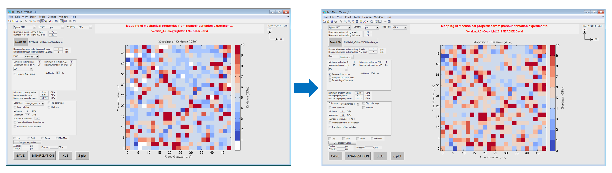
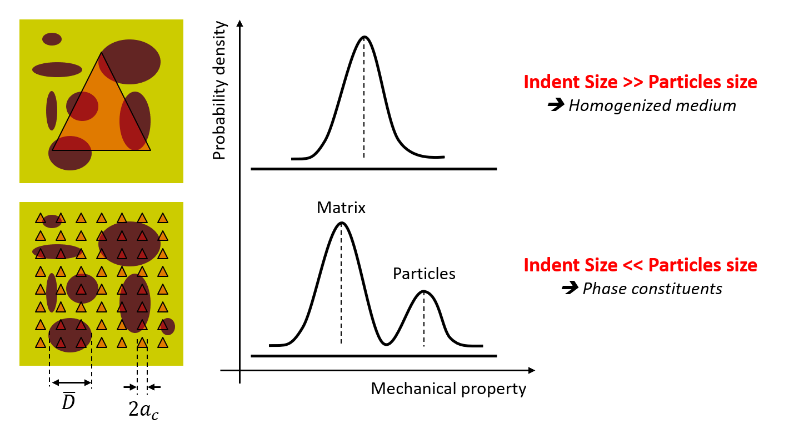
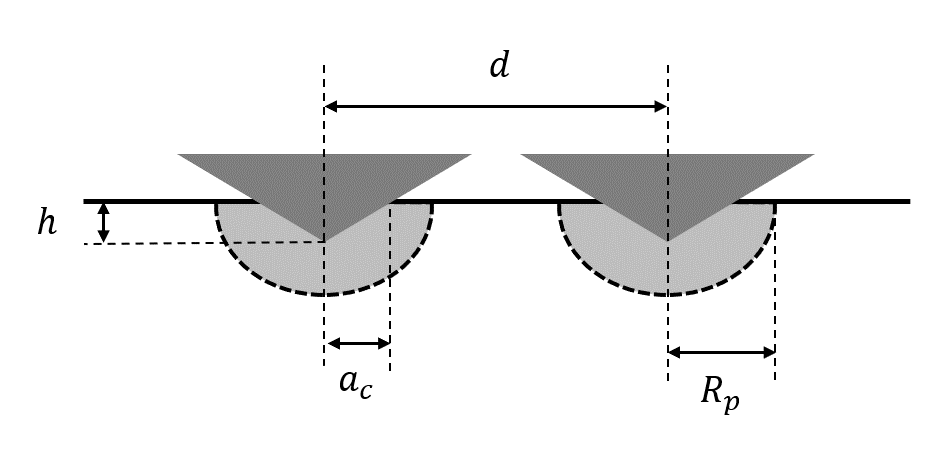
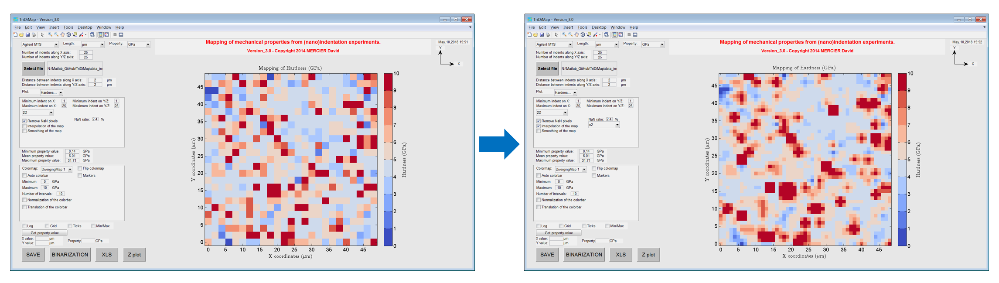

(Nano-)Indentation mapping
==========================

.. include:: includes.rst

Indentation grid technique
---------------------------

Mechanical property mapping are generated by plotting (nano-)indentation results obtained using the grid indentation technique.
The nanoindentation grid technique is well described in the paper written by Constantinides et al. [#Constantinides_2006]_,
but also in the following references [#Němeček_2009]_ and [#Randall_2009]_.

Position of each (nano-)indentation test or distance between indents has to be known or recorded,
in order to plot a consistent mechanical property map representative of the experiment.

An indentation map is represented mathematically using a matrix of N columns by M rows. If positions of indentation tests are not known,
it is required to know the pattern of indentation tests (line by line, snake shape, diagonals...).
An example of a pattern is given `here <https://tridimap.readthedocs.io/en/latest/examples.html#>`_

An example of 2D generated hardness map is given below. By default, a pixelized map is plotted.
Each pixel represents an indentation test and the color of a pixel corresponds to the the intensity of the calculated mechanical property.
In the given following screenshot, the white pixels corresponds to tests, which failed (NaN = Not a numeric).
Indentation failure corresponds to traditional artifacts of indentation testing (error on surface detection
because of contamination/roughness/topography effects, error with the thermal drift correction, etc...).
A ratio of failed tests over total number of indentation tests is given on the left part of the GUI,
to estimate the experimental validity of the indentation tests.
For example, more than 20% of failed tests start to be problematic for the results analysis...
But, this is an empirical statement, which depends on the NaN pixels distribution over the map.
To remove these empty pixels, it is possible to tick a checkbox into the settings on the GUI,
and a mechanical property value is attributed to the empty pixel, by doing a simple averaging of the surrounding pixels (8 in total).

.. figure:: ./_pictures/MTS_example1_25x25_H_GUI_00.png
   :scale: 40 %
   :align: center
   
   *Raw 2D hardness map obtained from a 25x25 indentation grid*

   
   *2D hardness map obtained from a 25x25 indentation grid with (left) and without (right) failed indentation.*  
   
Indentation length scales
---------------------------

According to Constantinides et al. [#Constantinides_2006]_, the indentation depth :math:`h` should be at most 1/10
of the characteristic size of the microstructure :math:`\overline{D}` (e.g.: particle size in a matrix, grain or void diameter...),
in order to apply continuum indentation analysis to heterogeneous systems and  to  access  phase  properties.
This rule refers to the well-known 10% rule of thumb proposed by Bückle [#Buckle_1973]_, which is a rough first estimation. 
In cases where the contrast between the mechanical properties of the two phases becomes significant
(e.g.: ratio between the elastic moduli lower than 0.2 or higher than 5), the method is not really reliable anymore
and special care should be taken in the interpretation of the indentation results.

Moreover, the indentation depth should be at least 3 times the mean square deviation of surface roughness (:math:`R_\text{q}` or :math:`R_\text{ms}`) [#Michałek_2019]_.

We can summarize previous explanations in the 2 following rules to respect for the indentation depth definition:
    * 1st rule: :math:`h < 0.1 \times \overline{D}`
    * 2nd rule: :math:`h > 3 \times R_\text{q}`

   
   *Schematic of the grid indentation technique for heterogeneous materials*

Once the maximum indentation depth is defined following these first rules, it is required to well define the distance between each indents.
To avoid overlap of adjacent indents, the distance :math:`d` between 2 indents has to be higher than the plastic radius :math:`R_\text{p}` below 1 indent.
Usually, the plastic radius in metals is between 3 and 6 times the contact radius :math:`a_\text{c}`, between the indenter and the sample surface.
And finally, the contact radius is roughly estimated to be 3.5 times the indentation depth :math:`h` in the case of Berkovich indentation
and 0.7 times the indentation depth in case of cube-corner indentation.

Thus, indentation step :math:`d` can be defined by the following rule of thumb in case of Berkovich indentation:

    .. math:: d > 2 \times R_\text{p} = 10.5\text{x to } 21\text{x }h
            :label: berkovich_indent_dist
			
And in case of cube-corner indentation:
            
    .. math:: d > 2 \times R_\text{p} = 2.1\text{x to } 4.2\text{x }h
            :label: cubecorner_indent_dist

   
   *Cross-sectional scheme of 2 side-by-side indents, with the definition of geometrical parameters*

More recently, it has been demonstrated that a minimum indent spacing of 10 times the indentation depth
was sufficient to obtain insignificant hardness deviation for different bulk materials and coatings tested
with a Berkovich indenter. And this result has been generalized for other indenter geometries (spherical and Vickers tips),
and it was found that a minimum indent spacing of 1.5 times the indent contact lateral dimension is enough to get accurate results [#SudharshanPhani_2019]_.

For example, let's have a sample of metallic matrix reinforced with 1 :math:`\text{micron}` radius ceramic particles,
and a with a surface sample RMS roughness estimated around 30 :math:`\text{nm}`.
The best indentation depth should be around 90-100 :math:`\text{nm}`, which respects both rules (for the microstructure and the surface roughness).
Then, the indentation step for the matrix grid can be set around 2-4 :math:`\text{micron}` with a Berkovich indenter.

Experimental artefacts
-----------------------

During indentation mapping, many different experimental artefacts can occur:
    * indenter wear / indenter blunting (especially with hard samples, e.g. Tungsten, Sapphire...) [#Nohava_2021]_
    * shift measurement (wrong calibration, temperature or vibration effects...)

As it is not really easy to take into account and correct such artefacts in the post mortem mapping analysis, it is recommended to redo new indentation experiments with another set of parameters or by controlling external variables (temperature, vibration...).

.. figure:: ./_pictures/ExperimentalShiftModulus.png
   :scale: 40 %
   :align: center
   
   *Problem of elastic modulus shift during indentation mapping on an homogeneous sample (maybe due to sample inclination)*

Interpolation step
-----------------------

The |matlab| function used to interpolate linearly the indentation maps is: `interp2.m <https://fr.mathworks.com/help/matlab/ref/interp2.html>`_

The process of interpolation does not modify the raw data intensity values, but increase the number of pixels,
by a given factor of x2, x4, x8 or x16 (default values, which can be modified).
No need to have bigger interpolation factor creating heavy maps, which will increase calculation and vizualization time.
For example, a map of 25x25 linearly interpolated by a factor of x2, becomes a map of 49x49 pixels.
After interpolation, it is possible to create a new .xls file (with interpolated dataset), by pressing the 'XLS' button at the bottom of the GUI.

   
   *Process of interpolation step*

Smoothing step
-----------------------

The |matlab| third party code used to smooth the indentation maps is: `smooth2a.m <https://fr.mathworks.com/matlabcentral/fileexchange/23287-smooth2a>`_

This smooth operation of a 2D matrix is based on a mean filter over a user-defined rectangle.
The smoothing step is a solution to apply to smooth sharp peaks or sharp valleys on the mechanical topography.
Sharpness can arises when there is a large difference in term of intensity between 1 pixel and its surrounding neighbors
(e.g. surface effects, or hard particle on a soft matrix, etc...).

.. figure:: ./_pictures/SmoothingStep.png
   :scale: 40 %
   :align: center
   
   *Process of smoothing step*
   
Smoothing process is a modification (clipping of the signal) of the raw values and an error map can be generated,
by simply calculating the difference between the non smoothed map (raw map) and the smoothed map.

.. figure:: ./_pictures/SmoothingStepError.png
   :scale: 30 %
   :align: center
   
   *Process to obtain error map after smoothing step*  

Linear interpolation and smoothing operations are sometimes applied on the raw dataset
in order to lessen pixelization effect and noise from the measurement, to get cleaner and more readable maps.

The |matlab| function used to interpolate and to smooth the indentation maps using TriDiMap is:
`TriDiMap_interpolation_smoothing.m <https://github.com/DavidMercier/TriDiMap/blob/master/matlab_code/module_mapping/TriDiMap_interpolation_smoothing.m>`_

Visualization of maps
-----------------------

It is possible to plot similar 2D or 3D other maps using different functions of Matlab:
    * `surf.m <https://fr.mathworks.com/help/matlab/ref/surf.html>`_
    * `surfc.m <https://fr.mathworks.com/help/matlab/ref/surfc.html>`_
    * `waterfall.m <https://fr.mathworks.com/help/matlab/ref/waterfall.html>`_
    * `contour.m <https://fr.mathworks.com/help/matlab/ref/contour.html>`_
    * `meshz.m <https://fr.mathworks.com/help/matlab/ref/meshz.html>`_
    * `bar.m <https://fr.mathworks.com/help/matlab/ref/bar.html>`_

..  warning::
    Indentation experiments are very sensitive to environmental effects and thermal drift. Usually, performing such indentation maps can be time-consuming....   

Overlay
-----------------------

To perform an overlay, the best is to save the mechanical map, using the 'SAVE' button (at the bottom of the GUI).
An image of the map only is saved (no axis, no colorbar...) into the same folder, where data were loaded from.
Then, using Powerpoint for example, it is possible to draw a rectangular shape onto the microstructural map
and to fill this rectangular shape using the saved mechanical map.
Then, transparency effect has to be applied (60%-70% for example) in order to see both maps.

.. note::
   It is better if micrographs are obtained before and after indentation experiments, respectively to have a nice overlay (without residual imprints) and to help for overlaying.
   

   
   *Overlay of hardness (on the left) and modulus of elasticity (on the right) maps with the optical microscopic observation of indentation grid (with 70% transparency)*
   
References
-------------
.. [#Constantinides_2006] `Constantinides G. et al., "Grid indentation analysis of composite microstructure and mechanics: Principles and validation" (2006). <https://doi.org/10.1016/j.msea.2006.05.125>`_
.. [#Michałek_2019] `Michałek J. et al., "Application of Nanoindentation and 2D and 3D Imaging to Characterise Selected Features of the Internal Microstructure of Spun Concrete" (2019). <https://doi.org/10.3390/ma12071016>`_
.. [#Němeček_2009] `Němeček J., "Nanoindentation of heterogeneous structural materials", PhD thesis (2009). <http://ksm.fsv.cvut.cz/~nemecek/teaching/dmpo/literatura/habilitation%20thesis_Nemecek_CTU-01-2010.pdf>`_
.. [#Randall_2009] `Randall N.X. et al., "Nanoindentation analysis as a two-dimensional tool for mapping the mechanical properties of complex surfaces" (2009). <https://doi.org/10.1557/jmr.2009.0149>`_
.. [#Buckle_1973] Bückle H., in: J.W. Westbrook, H. Conrad (Eds.), The Science of Hardness Testing and Its Applications, American Society for Metals, Metal Park OH, 1973, pp. 453–459.
.. [#SudharshanPhani_2019] `Sudharshan Phani P. and Oliver W.C., "A critical assessment of the effect of indentation spacing on the measurement of hardness and modulus using instrumented indentation testing" (2019). <https://doi.org/10.1016/j.matdes.2018.107563>`_
.. [#Nohava_2021] `Nohava, J. et al., "Indenter wear study and proposal of a simple method for evaluation of indenter blunting" (2021). <https://doi.org/10.1557/s43578-021-00401-4>`_
