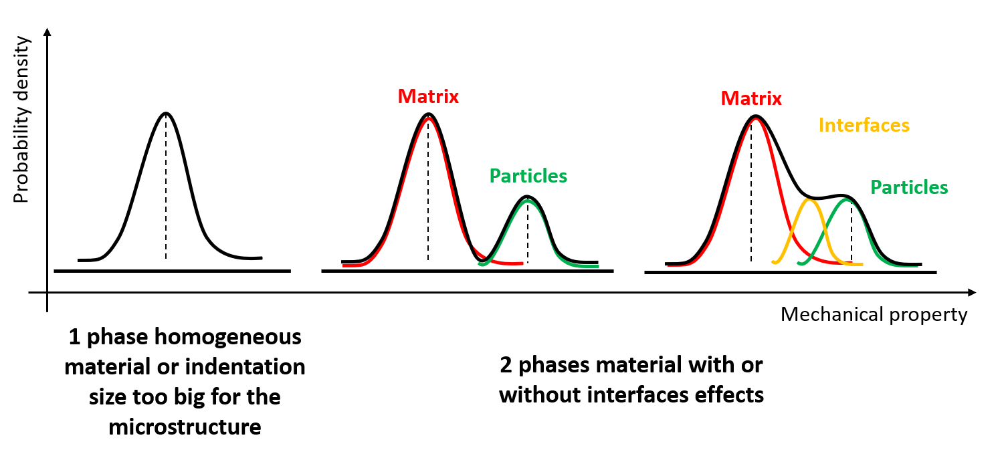
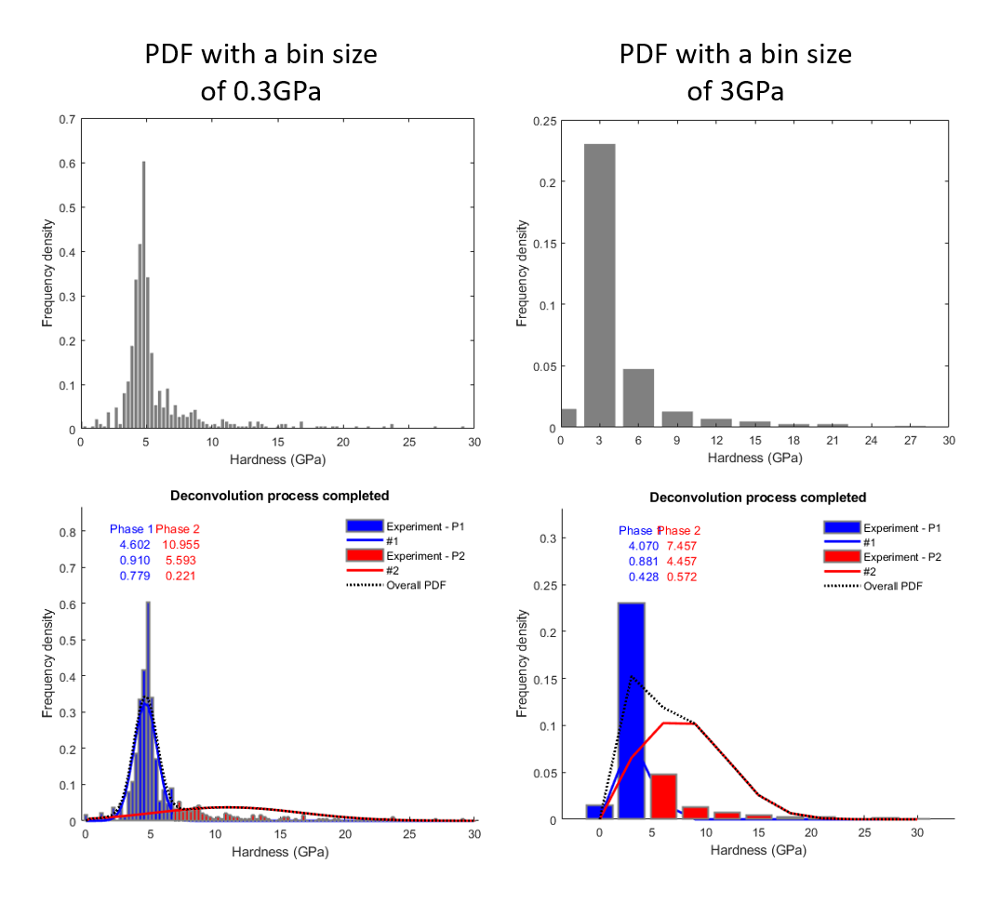
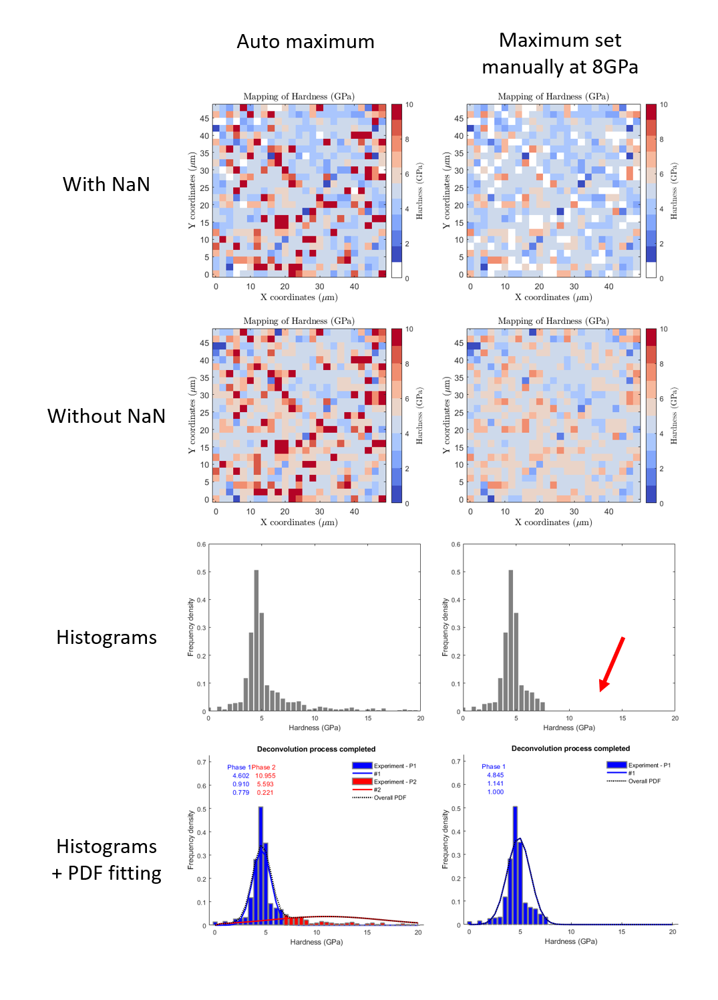

Statistical analysis
==========================

.. include:: includes.rst

For statistical analysis of the mechanical property values distribution, it is possible
to use histograms or to use a cumulative distribution.

Probability density function (PDF)
############################################

.. figure:: ./_pictures/MTS_example1_25x25_H_GUI_13.png
   :scale: 50 %
   :align: center
   
   *Histograms of hardness values*

Using histograms is really interesting for
the visualization point of view with a common pattern, like the bell–shaped curve.
Such a curve is known as the "normal distribution" or the "Gaussian distribution".
For an homogeneous material, only 1 peak is expected and for an heterogeneous material,
a peak per phase can be expected. In this last case, intermediate peaks between phase peaks can be observed
when interfaces are not spatially negligible. The drawback of this plot is the user-dependence
of the bin size and thus of the distribution shape (i.e. peak intensity).
Indeed, the shape of the distributions is bin size dependent, while this bin size (e.g. 0.5GPa or 3GPa) is defined arbitrary by the user.
This issue is well known in the literature and is a little bit discussed in this presentation [#Mercier_2016]_ and this paper [#Hrbek_2017]_.

   
   *Example of different fitted histogram distribution schematized as a function of the specimen*
   

   
   *Effect of the bin size definition on the distribution shape*

The next step is to fit this distribution using a probability density function.
Such mathematical approach is very well defined in the literature [#Nemecek_2009]_, [#Nemecek_2013]_ and [#Hausild_2016]_.
It is worth to note that the result obtain after deconvolution (average values and standard deviations for each peak) is dependent of the
bin size. A solution to avoid user definition of the bin size is to use the Freedman–Diaconis rule of thumb, which gives an estimation of 
the bin size after calculation of the interquartile range (IQR) of the data. To activate this option, check the box for 'Auto Bin Size' on the GUI.

    .. math:: \text{Bin Size} = \frac{2*IQR}{n^{\frac{1}{3}}}
        :label: binSizeAuto

With :math:`n` is the number of observations in the sample.

The |matlab| function used to calculate the interquartile range of the data is:
`iqrVal.m <https://github.com/DavidMercier/TriDiMap/blob/master/matlab_code/util/iqrVal.m>`_

The |matlab| function used to plot the distribution of mechanical property values using histogram is:
`pdfGaussian.m <https://github.com/DavidMercier/TriDiMap/blob/master/matlab_code/util/pdfGaussian.m>`_

The |matlab| function used to fit using a probability density function and to process the deconvolution is:
`TriDiMap_runDeconvolution.m <https://github.com/DavidMercier/TriDiMap/blob/master/matlab_code/module_mapping/TriDiMap_runDeconvolution.m>`_

This last function has been extensively inspired by the work of Němeček J. et al. [#Nemecek_2010_1]_, [#Nemecek_2010_2]_ and [#Nemecek_2010_3]_.

An example of fitting and deconvolution process is given in the following figure.
   
.. figure:: ./_pictures/MTS_example1_25x25_H_GUI_14.png
   :scale: 50 %
   :align: center
   
   *Histograms of hardness values with Gaussian PDF after fitting and deconvolution step*

.. note::
   Effect of the interphase can be considered and could be implemented in this toolbox [#Cech_2017]_.
   
.. note::
   The choice of the bin size could be defined as an automatic calculation, based on the number of phases, the number of data and the minimum of peak intensity...

When data are noisy due to experimental artefacts (e.g. surface contamination, interfaces effect or interesting phase inside the sample...) for example,
with very high or very low mechanical property values, it is always possible to cut the signal, by setting manually (on the GUI) the extrema.
This operation can be seen as an arbtrary cleaning, but careful with a fitting process,
which gives different mean values, given peak shapes or peak number modification.

   
   *Example of manually saturated indentation data, with a comparison between automatic maximum and a maximum set to 8GPa*

.. note::
   Sometimes the fit does not converge, just restart the fitting process... or change a little bit the bin size.
   
Cumulative density function (CDF)
############################################

The cumulative distribution of mechanical property is much better than an histogram plot.
But, it is much more difficult to decompose and in this toolbox, only a Weibull fitting is proposed,
which is only interesting for an homogeneous material. The Weibull function is from the PopIn toolbox [#popin]_.

The |matlab| function used to plot the cumulative distribution of mechanical property values is:
`cdfGaussian.m <https://github.com/DavidMercier/TriDiMap/blob/master/matlab_code/util/cdfGaussian.m>`_

The |matlab| function used to fit the cumulative distribution with a Weibull function is:
`TriDiMap_Weibull_cdf.m <https://github.com/DavidMercier/TriDiMap/blob/master/matlab_code/module_mapping/TriDiMap_Weibull_cdf.m>`_
   
.. figure:: ./_pictures/MTS_example1_25x25_H_GUI_15.png
   :scale: 50 %
   :align: center
   
   *Cumulative distribution of hardness values*
   
.. figure:: ./_pictures/MTS_example1_25x25_H_GUI_16.png
   :scale: 50 %
   :align: center
   
   *Cumulative distributions of hardness values with Weibull fit*  
   
References
############################################

.. [#Nemecek_2009] `Němeček J., "Nanoindentation of heterogeneous structural materials", PhD thesis (2009). <http://ksm.fsv.cvut.cz/~nemecek/teaching/dmpo/literatura/habilitation%20thesis_Nemecek_CTU-01-2010.pdf>`_
.. [#Nemecek_2010_1] `Němeček J., "Probability density function 1.0" (2010). <http://ksm.fsv.cvut.cz/~nemecek/links/exp2pdf10/exp2pdf10.htm>`_
.. [#Nemecek_2010_2] `Němeček J., "Probability density function 2.1" (2010). <http://ksm.fsv.cvut.cz/~nemecek/links/exp2pdf21/exp2pdf21.htm>`_
.. [#Nemecek_2010_3] `Němeček J., "Deconvolution algorithm 3.0" (2010). <http://ksm.fsv.cvut.cz/~nemecek/links/decon30/decon.htm>`_
.. [#Nemecek_2013] `Němeček J. et al., "Micromechanical analysis of heterogeneous structural materials" (2013). <https://doi.org/10.1016/j.cemconcomp.2012.06.015>`_
.. [#Hausild_2016] `Haušild P. et al., "Determination of the individual phase properties from the measured grid indentation data" (2016). <https://doi.org/10.1557/jmr.2016.375>`_
.. [#Mercier_2016] `Mercier D. et al., "Combined techniques for the characterization of an electrodeposited Nickel coating with embedded SiC particles: from microstructure to local mechanical properties" (2016). <https://doi.org/10.13140/RG.2.2.13062.16962>`_
.. [#Hrbek_2017] `Hrbek V. and Koudelková V., "Grid Indentation and Statistic Deconvolution: Limitations and Accuracy" (2017). <https://dx.doi.org/10.4028/www.scientific.net/KEM.731.15>`_
.. [#Cech_2017] `Čech J.et al., "Approche statistique pour identifier les propriétés mécaniques des phases individuelles à partir de données d’indentation" (2017). <https://doi.org/10.1051/mattech/2016041>`_
.. [#popin] `Mercier D.et al., "PopIn documentation". <https://popin.readthedocs.io/en/latest/models.html#weibull-type-distribution>`_
