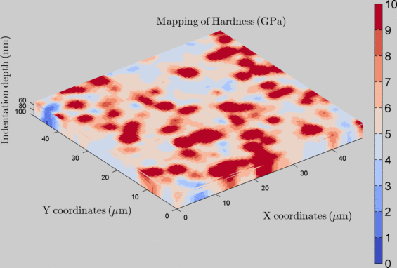
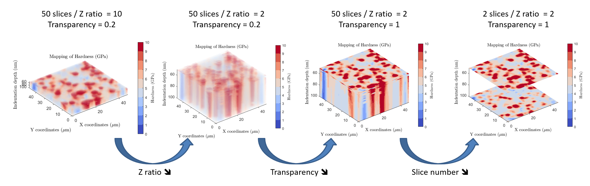

Nanoindentation tomography
============================

.. include:: includes.rst

3D / 4D map
-------------

Instrumented indentation technique provides usually contact stiffness, indenter displacement, and applied load as a function of position (horizontal and vertical), 
within a volume of tested material by using the dynamic mode (i.e. continuous stiffness measurement or CSM). From such experiments, it is possible to obtain precise and accurate mechanical property 
gradients [#Tromas_2012]_ or tomograms [#Coy_2016]_ (i.e., volumetric information). At each indentation depth, corresponds a mechanical property map (i.e. a slice).
By stacking each map or slice on each other, it is possible to generate a 3D representation of the indentation experiment.
In the literature, such maps are sometimes described as 4D map [#Coy_2016]_, with the first and the second dimensions as the indentation position,
the 3rd dimension as the indentation depth and the 4th dimension as the mechanical property value.

Some options are available for the graphical rendering of the tomographic visualization.
For example, it is possible to modify the "Z axis ratio" value, to increase or decrease the vertical over the horizontal scale ratio.
Higher is this ratio and lower is the vertical expansion. Another interesting option is the transparency effect. It is possible to
make the tomogram fully opaque (variable set to 1) or fully transparent (variable set to 0).

The |matlab| function used to generate 3D or 4D maps is: `slice.m <https://fr.mathworks.com/help/matlab/ref/slice.html>`_

..  warning::
    It is not a 3D reconstruction, thus no need to align, to rotate or to distort the different slices. There is no misalignment or local disorientation, only if the indentation direction is not perpendicular to the sample surface.

   
   *4D mapping of sample hardness obtained from indentation tests (25x25 pixels x25 slices)*
   

   
   *Different settings for the 4D indentation mapping vizualization*

.. note::
    To generate such 4D map, it is required the first time to load raw *.xls files. Given the fact, that the imported data is saved as *.mat into the same folder, it is possible the next time to reload only this *.mat file to save some loading time...

Example of a .mat file: `MTS_example1_25x25.xls_3DSlice.mat <https://github.com/DavidMercier/TriDiMap/blob/master/data_indentation/MTS_example1_25x25.xls_3DSlice.mat>`_
	
References
-------------
.. [#Tromas_2012] `Tromas C. et al., "Hardness and elastic modulus gradients in plasma-nitrided 316L polycrystalline stainless steel investigated by nanoindentation tomography" (2012). <https://doi.org/10.1016/j.matdes.2016.09.030>`_
.. [#Coy_2016] `Coy E. et al., "Topographic reconstruction and mechanical analysis of atomic layer deposited Al2O3/TiO2 nanolaminates by nanoindentation" (2016). <https://doi.org/10.1016/j.actamat.2011.12.012>`_
