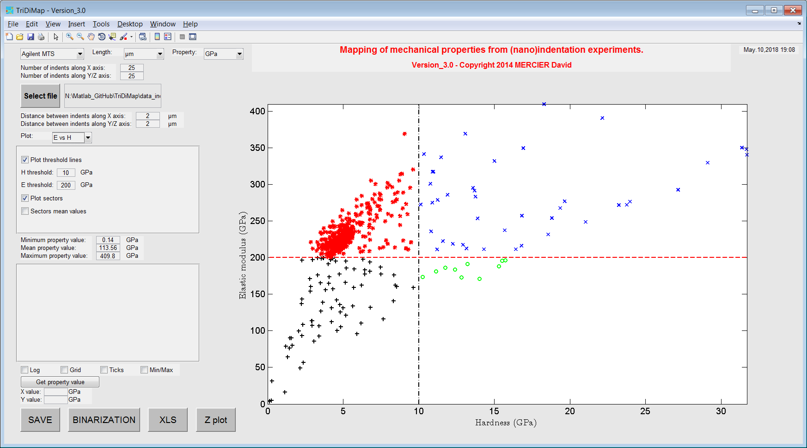
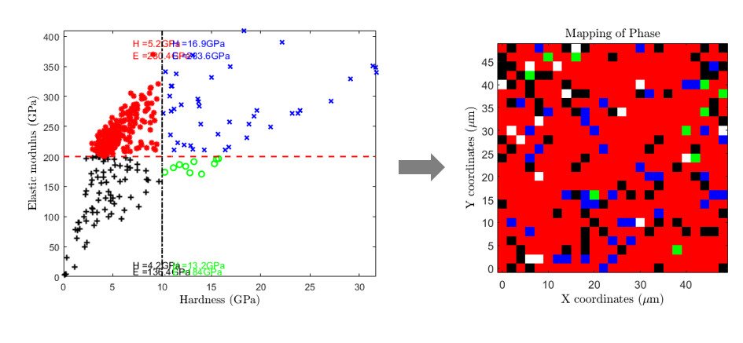
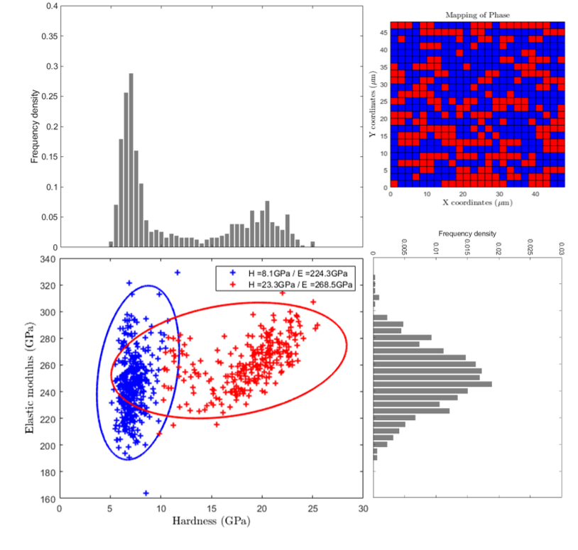

Elastic modulus vs Hardness plot
=================================

.. include:: includes.rst

Another way to visualize the distribution of mechanical property results is to plot for example
the elastic modulus (E) values vs the hardness (H) values. Such a plot leads sometimes to the observation of 
families of points and the definition of "sectors" or "bubbles",
each one corresponding to a single phase (e.g. soft matrix vs hard and stiff particles).

The correlation between elastic and plastic properties has been extensively studied in the literature
[#Gent_1958]_, [#Bao_2004]_, [#Oyen_2006]_ and [#Labonte_2017]_.

.. note::
    Elastic modulus is an intrinsic material property and hardness is an engineering property, which can be related to yield strength for some materials.

E-H map sectorization
############################################

As a first analysis of such a plot, sectors can be defined by giving an average value of elastic modulus and
an average of hardness value, separating respectively by an horizontal line
and a vertical line the different bubbles of points.
Each sector is defined by a unique color.

Finally, average values of mechanical properties are given for each sectors directly into the graph,
and a 4 color-coded map corresponding to this plot can be generated (see 2nd figure).

   
   *Example of sectorized elastic modulus vs hardness plot*
   

   
   *Sectorized elastic modulus vs hardness plot with mean values and corresponding mechanical map*

Automated cluster analysis (K-Means, Gaussian Mixture, ...)
############################################

Cluster analysis, or clustering, is an unsupervised machine learning technique used to group similar data points based on inherent patterns or features. Common clustering algorithms include K-Means and Gaussian Mixture Models (GMMs), both of which are widely applied to nanoindentation datasets. For instance, a recent comparative study explores the performance of various clustering methods on nanoindentation mapping data [#Alizade_2025]_. These techniques are usually applied to E-H plots. But it is also possible to add a 3rd property (E/H or Kernel average mechanicl mismatch...) to help the clustering analysis [#Mercier_2025]_.

K-Means models
+++++++++++++++++++++++++++
K-Means clustering is frequently used for the analysis of nanoindentation data [#Koumoulos_2019], [#Konstantopoulos_2020], [#Alhamdani_2022], [#Jentner_2023]. As explained in [#Koumoulos_2019]_, the K-Means algorithm aims to partition n observations into k clusters, where each observation belongs to the cluster with the nearest mean—this mean serving as a prototype of the cluster. The number of clusters k is predefined, and each point is assigned exclusively to one cluster.

Initially, k cluster centroids are randomly initialized. Each data point is then assigned to the cluster whose centroid is closest in terms of Euclidean distance. After all points are assigned, the algorithm recalculates the centroids as the mean of the points in each cluster. This process—assignment followed by centroid update—is repeated iteratively until convergence. A concise description of this method is also available in the |matlab| documentation [#Matlab_KM]_.

A possible |matlab| third party code, which could be used to define clusters with K-Means model is: https://www.mathworks.com/matlabcentral/fileexchange/24616-kmeans-clustering?s_tid=mwa_osa_a

Gaussian mixture models
+++++++++++++++++++++++++++

The GMMs model are as well used for nanoindentation data clustering [#Wilson_2018]_ and [#Chen_2021]_.
This method is well described  in the |matlab| documentation [#Matlab_GMM]_, [#Matlab_cluster]_ and [#Matlab_clustering]_ but also in the literature [#Fraley_1998]_.

This method is powerful to separate contribution of 2 or 3 phases (especially in the case of a soft metallic matrix with hard ceramic particles) 
in the cloud of experimental points [#Hu_2005]_.
Average mechanical property values can also be extracted using this method and a 2 or 3 color map can be obtained too.

The influence of indentation size and spacing on statistical phase analysis has also been studied by fast mapping indentation anc clustering analysis [#Besharatloo_2021]_.

The |matlab| third party code used to define clusters with GMs model is: `GMMClustering.m <https://github.com/DavidMercier/TriDiMap/blob/master/third_party_codes/GMMClustering/GMMClustering.m>`_

   
   *Elastic modulus vs hardness plot with clusters of points obtained with GMM*

Determination of the number of clusters
+++++++++++++++++++++++++++

The optimal number of clusters (k) can be determined using the elbow method.
This method looks at the total within-cluster sum of square (WSS) as a function of the number of clusters.
One should choose a number of clusters so that adding another cluster doesn't improve much better the total WSS.

This method can be defined as follow in 4 steps:
1) Compute clustering algorithm (e.g., K-Means or GMs algorithms) for different values of k.
2) For instance, by varying k from 1 to 5 clusters. For each k, calculate the total WSS.
3) Then, plot the curve of WSS according to the number of clusters k.
4) Finally, the location of a bend (knee) in the plot is generally considered as an indicator of the appropriate number of clusters.

Note that, the elbow method is sometimes ambiguous.
Alternatives are for example the average silhouette method or the gap statistic method...

Next steps: Ashby map or self-organized maps
############################################

The next step after the different analytical, sectorization, clustering...  approaches, could be to use nanoindentation outputs 
(phase mechanical properties in the case of a composite, an alloy...) for material selection, material design, material discovery....

A common strategy for material selection is the usage of conventional Ashby map [#Ashby_2005]_.
An example of a typical Ashby map is given afterwards with materials families (envelops around different materials), using the CES Selector 2018 software [#CES_Selector]_.
At some point, it is possible to add material reference (bulk, homogeneous, monophasic, ...) values on the E-H map,
in order to compare experimental data with data from the literature.

.. figure:: ./_pictures/E-H_Ashby.png
   :scale: 50 %
   :align: center
   
   *Typical Ashby map of elastic modulus vs Vickers hardness, obtained using CES Selector software*
   
Regarding material design or material discovery, an option is the usage of self-organized maps (SOMs) 
[#Qian_2019]_ in the framework of material informatics. Here an example for Atomic Force Microscopy (AFM) technique [#Weber_2023]_.
	
References
############################################

.. [#Alhamdani_2022] Alhamdani S.G. et al., "Cluster-Based Colormap of Nanoindentation Using Machine Learning" (2022). <https://doi.org/10.46254/AN12.20220621>`_
.. [#Alizade_2025] Alizade M. et al., "A Comparative Study of Clustering Methods for Nanoindentation Mapping Data" (2025). <http://dx.doi.org/10.1007/s40192-024-00349-3>_
.. [#Ashby_2005] Ashby M.F., "Materials Selection in Mechanical Design" (2005), ISBN 978-0-7506-6168-3.
.. [#Bao_2004] `Bao Y.W. et al., "Investigation of the relationship between elastic modulus and hardness based on depth-sensing indentation measurements" (2004). <https://doi.org/110.1016/j.actamat.2004.08.002>`_
.. [#Besharatloo_2021] `Besharatloo H. and Wheeler J.M., "Influence of indentation size and spacing on statistical phase analysis via high‑speed nanoindentation mapping of metal alloys" (2021). <https://doi.org/10.1557/s43578-021-00214-5>`_
.. [#CES_Selector] `CES Selector 2018 <https://www.grantadesign.com/>`_
.. [#Chen_2021] `Chen X. et al., "Clustering analysis of grid nanoindentation data for cementitious materials (2021). <https://link.springer.com/article/10.1007/s10853-021-05848-8>`_
.. [#Fraley_1998] `Fraley C. and Raftery A.E., "How Many Clusters? Which Clustering Method? Answers Via Model-Based Cluster Analysis" (1998). <https://doi.org/10.1093/comjnl/41.8.578>`_
.. [#Gent_1958] `Gent A.N., "On the Relation between Indentation Hardness and Young's Modulus." (1958). <https://doi.org/10.5254/1.3542351>`_
.. [#Hu_2005] `Hu C., "Nanoindentation as a tool to measure and map mechanical properties of hardened cement pastes" (2005). <https://doi.org/10.1557/mrc.2015.3>`_
.. [#Jentner_2023] `Jentner R.M. et al., "Unsupervised clustering of nanoindentation data for microstructural reconstruction: Challenges in phase discrimination" (2023). <https://doi.org/10.1016/j.mtla.2023.101750>`_
.. [#Konstantopoulos_2020] `Konstantopoulos G. et al., "Classification of mechanism of reinforcement in the fiber-matrix interface: Application of Machine Learning on nanoindentation data" (2020). <https://doi.org/10.1016/j.matdes.2020.108705>`_
.. [#Koumoulos_2019] `Koumoulous E.P. et al., "Constituents Phase Reconstruction through Applied Machine Learning in Nanoindentation Mapping Data of Mortar Surface" (2019). <https://doi.org/10.3390/jcs3030063>`_
.. [#Labonte_2017] `Labonte D. et al., "On the relationship between indenation hardness and modulus, and the damage resistance of biological materials" (2017). <https://doi.org/10.1016/j.actbio.2017.05.034>`_
.. [#Matlab_GMM] `Mathworks - Gaussian Mixture Models <https://fr.mathworks.com/help/stats/gaussian-mixture-models-1.html>`_
.. [#Matlab_KM] `Mathworks - K-Means Models <https://www.mathworks.com/help/stats/kmeans.html>`_
.. [#Matlab_cluster] `Mathworks - Cluster <https://fr.mathworks.com/help/stats/gmdistribution.cluster.html>`_
.. [#Matlab_clustering] `Mathworks - Cluster Using Gaussian Mixture Models <https://fr.mathworks.com/help/stats/clustering-using-gaussian-mixture-models.html>`_
.. [Mercier_2025] `Mercier D. and El Gharoussi Y., "Unsupervised Machine Learning for Nanoindentation Mapping Analysis and Microstructural Correlation" (2025). <http://dx.doi.org/10.13140/RG.2.2.29301.49125>_
.. [#Oyen_2006] `Oyen M.L., "Nanoindentation hardness of mineralized tissues" (2006). <https://doi.org/10.1016/j.jbiomech.2005.09.011>`_
.. [#Qian_2019] `Qian J., "Introducing self-organized maps (SOM) as a visualization tool for materials research and education" (2019). <https://doi.org/10.1016/j.rinma.2019.100020>`_
.. [#Weber_2023] `Weber A., "Application of self-organizing maps to AFM-based viscoelastic characterization of breast cancer cell mechanics" (2023). <https://doi.org/10.1038/s41598-023-30156-3>`_
.. [#Wilson_2018] `Wilson W. et al., "Automated coupling of NanoIndentation and Quantitative EnergyDispersive Spectroscopy (NI-QEDS): A comprehensive method to disclose the micro-chemo-mechanical properties of cement pastes" (2018). <https://doi.org/10.1016/j.cemconres.2017.08.016>`_
