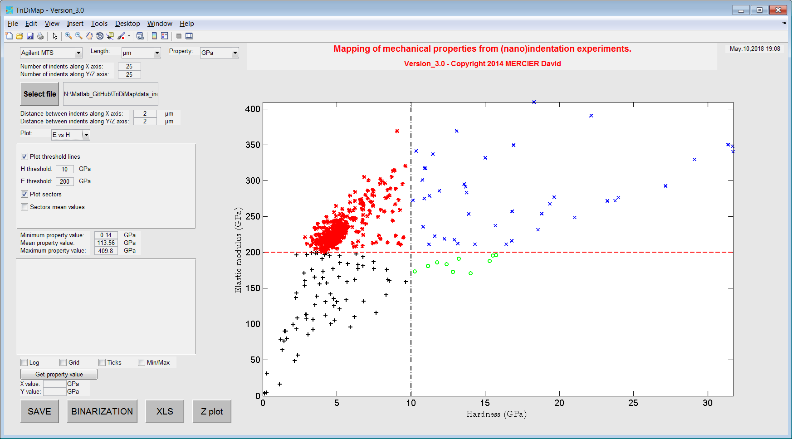
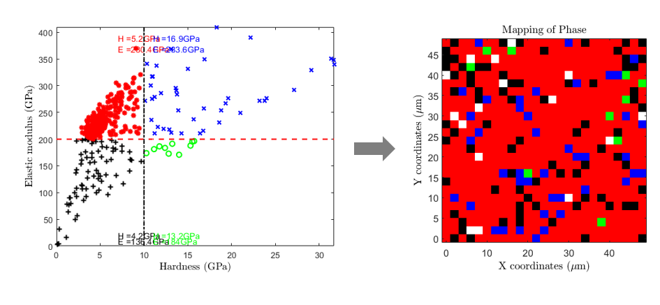
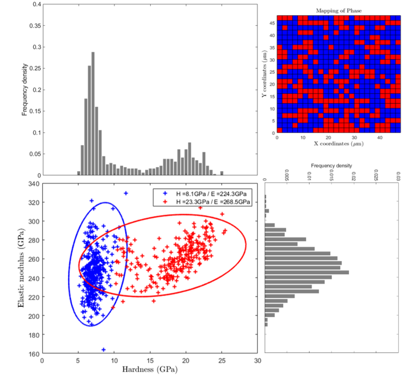
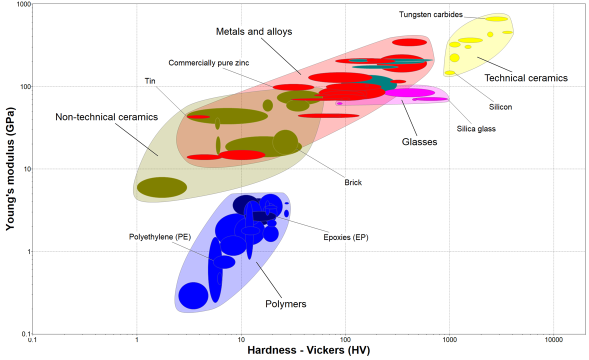

Elastic modulus vs Hardness plot
=================================

.. include:: includes.rst

Another way to visualize the distribution of mechanical property results is to plot, for example, the elastic modulus (E) versus the hardness (H). Such a plot can sometimes reveal families of points and the emergence of “sectors” or “bubbles,” each one corresponding to a single phase (e.g., a soft matrix versus hard and stiff particles).

The correlation between elastic and plastic properties has been extensively studied in the literature [#Gent_1958], [#Bao_2004], [#Oyen_2006], [#Labonte_2017].

.. note::
The elastic modulus is an intrinsic material property, whereas hardness is an engineering property. For some classes of materials, hardness can be related to the yield strength.

E–H map sectorization
############################################

As a first analysis, sectors can be defined by specifying average elastic modulus and hardness values. Horizontal and vertical threshold lines can then be introduced to delimit the different “bubbles” of points. Each sector is represented using a unique color.

Finally, average mechanical properties for each sector are displayed directly on the plot, and a four-color mechanical map corresponding to this sectorization can also be produced (see second figure).

:scale: 50 %
:align: center

Example of a sectorized elastic modulus vs hardness plot

:scale: 50 %
:align: center

Sectorized elastic modulus vs hardness plot with mean values and the corresponding mechanical map

Automated cluster analysis (K-Means, Gaussian Mixture Models, …)
############################################

Cluster analysis (or clustering) is an unsupervised machine-learning technique used to group similar data points based on inherent patterns. Common clustering algorithms include K-means and Gaussian Mixture Models (GMMs), both of which are widely applied to nanoindentation datasets. A recent comparative study evaluates the performance of several clustering methods on nanoindentation mapping data [#Alizade_2025]_.

These techniques are typically applied to E–H plots, but additional parameters—such as E/H or the Kernel Average Mechanical Mismatch—can also be included to improve clustering results [#Mercier_2025]_.

K-Means models
+++++++++++++++++++++++++++

K-means clustering is commonly used for nanoindentation analysis [#Koumoulos_2019], [#Konstantopoulos_2020], [#Alhamdani_2022], [#Jentner_2023]. As described in [#Koumoulos_2019]_, the algorithm partitions n observations into k clusters, where each observation belongs to the cluster with the nearest mean (the cluster centroid). The number of clusters k must be defined beforehand, and each point is assigned exclusively to one cluster.

The algorithm starts by initializing k random centroids. Each data point is then assigned to the nearest centroid (based on Euclidean distance). The centroids are updated as the mean of the assigned points. These assignment–update steps are repeated until convergence. A concise description is provided in the |matlab| documentation [#Matlab_KM]_.

A third-party |matlab| implementation of K-means is available at:
https://www.mathworks.com/matlabcentral/fileexchange/24616-kmeans-clustering?s_tid=mwa_osa_a

Gaussian Mixture Models
+++++++++++++++++++++++++++

Gaussian Mixture Models (GMMs) are also widely used for nanoindentation data clustering [#Wilson_2018], [#Chen_2021]. This method is described in the |matlab| documentation [#Matlab_GMM], [#Matlab_cluster], [#Matlab_clustering]_ as well as in the literature [#Fraley_1998]_.

GMMs are particularly effective at separating contributions from two or three phases (e.g., a soft metallic matrix containing hard ceramic particles) within a cloud of experimental points [#Hu_2005]_. Average mechanical properties can be extracted for each phase, and a two- or three-color mechanical map can be generated.

The influence of indentation size and spacing on statistical phase analysis has also been investigated using fast-mapping indentation combined with clustering analysis [#Besharatloo_2021]_.

The |matlab| code used for GMM clustering is:
GMMClustering.m <https://github.com/DavidMercier/TriDiMap/blob/master/third_party_codes/GMMClustering/GMMClustering.m>_

:scale: 50 %
:align: center

Elastic modulus vs hardness plot with clusters obtained using a GMM approach

Determination of the number of clusters
+++++++++++++++++++++++++++

The optimal number of clusters (k) can be estimated using the elbow method, which examines how the total within-cluster sum of squares (WSS) evolves with increasing k. One should select k such that adding an additional cluster yields only marginal improvement in the WSS.

This procedure is usually implemented in four steps:

Run the clustering algorithm (e.g., K-means or GMM) for several values of k.

Evaluate the total WSS for each k (e.g., k = 1–5).

Plot WSS as a function of k.

Identify the “elbow,” where the rate of decrease in WSS sharply changes.

The elbow method may be ambiguous in some cases. Alternatives include the average silhouette method and the gap statistic.

Next steps: Ashby maps or Self-Organized Maps (SOMs)
############################################

Following analytical approaches, sectorization, and clustering, nanoindentation outputs (e.g., phase-specific mechanical properties of composites or alloys) can be used for material selection, material design, or material discovery.

A common strategy for material selection is the use of Ashby maps [#Ashby_2005]. A typical example, created with CES Selector 2018 [#CES_Selector], is shown below. Reference material values (bulk, homogeneous, monophasic, …) can also be added to the E–H map to compare experimental results with literature data.

:scale: 50 %
:align: center

Typical Ashby map of elastic modulus vs Vickers hardness, obtained using CES Selector software

For material design and discovery, Self-Organized Maps (SOMs) [#Qian_2019]_ can be used within a materials-informatics framework. An example of SOM-based analysis for AFM viscoelastic mapping is presented in [#Weber_2023]_.
	
References
############################################

.. [#Alhamdani_2022] `Alhamdani S.G. et al., "Cluster-Based Colormap of Nanoindentation Using Machine Learning" (2022). <https://doi.org/10.46254/AN12.20220621>`_
.. [#Alizade_2025] `Alizade M. et al., "A Comparative Study of Clustering Methods for Nanoindentation Mapping Data" (2025). <https://doi.org/10.1007/s40192-024-00349-3>`_
.. [#Ashby_2005] Ashby M.F., "Materials Selection in Mechanical Design" (2005), ISBN 978-0-7506-6168-3.
.. [#Bao_2004] `Bao Y.W. et al., "Investigation of the relationship between elastic modulus and hardness based on depth-sensing indentation measurements" (2004). <https://doi.org/110.1016/j.actamat.2004.08.002>`_
.. [#Besharatloo_2021] `Besharatloo H. and Wheeler J.M., "Influence of indentation size and spacing on statistical phase analysis via high‑speed nanoindentation mapping of metal alloys" (2021). <https://doi.org/10.1557/s43578-021-00214-5>`_
.. [#CES_Selector] `CES Selector 2018 <https://www.grantadesign.com/>`_
.. [#Chen_2021] `Chen X. et al., "Clustering analysis of grid nanoindentation data for cementitious materials (2021). <https://link.springer.com/article/10.1007/s10853-021-05848-8>`_
.. [#Fraley_1998] `Fraley C. and Raftery A.E., "How Many Clusters? Which Clustering Method? Answers Via Model-Based Cluster Analysis" (1998). <https://doi.org/10.1093/comjnl/41.8.578>`_
.. [#Gent_1958] `Gent A.N., "On the Relation between Indentation Hardness and Young's Modulus." (1958). <https://doi.org/10.5254/1.3542351>`_
.. [#Hu_2005] `Hu C., "Nanoindentation as a tool to measure and map mechanical properties of hardened cement pastes" (2005). <https://doi.org/10.1557/mrc.2015.3>`_
.. [#Jentner_2023] `Jentner R.M. et al., "Unsupervised clustering of nanoindentation data for microstructural reconstruction: Challenges in phase discrimination" (2023). <https://doi.org/10.1016/j.mtla.2023.101750>`_
.. [#Konstantopoulos_2020] `Konstantopoulos G. et al., "Classification of mechanism of reinforcement in the fiber-matrix interface: Application of Machine Learning on nanoindentation data" (2020). <https://doi.org/10.1016/j.matdes.2020.108705>`_
.. [#Koumoulos_2019] `Koumoulous E.P. et al., "Constituents Phase Reconstruction through Applied Machine Learning in Nanoindentation Mapping Data of Mortar Surface" (2019). <https://doi.org/10.3390/jcs3030063>`_
.. [#Labonte_2017] `Labonte D. et al., "On the relationship between indenation hardness and modulus, and the damage resistance of biological materials" (2017). <https://doi.org/10.1016/j.actbio.2017.05.034>`_
.. [#Matlab_GMM] `Mathworks - Gaussian Mixture Models <https://fr.mathworks.com/help/stats/gaussian-mixture-models-1.html>`_
.. [#Matlab_KM] `Mathworks - K-Means Models <https://www.mathworks.com/help/stats/kmeans.html>`_
.. [#Matlab_cluster] `Mathworks - Cluster <https://fr.mathworks.com/help/stats/gmdistribution.cluster.html>`_
.. [#Matlab_clustering] `Mathworks - Cluster Using Gaussian Mixture Models <https://fr.mathworks.com/help/stats/clustering-using-gaussian-mixture-models.html>`_
.. [#Mercier_2025] `Mercier D. and El Gharoussi Y., "Unsupervised Machine Learning for Nanoindentation Mapping Analysis and Microstructural Correlation" (2025). <http://dx.doi.org/10.13140/RG.2.2.29301.49125>`_
.. [#Oyen_2006] `Oyen M.L., "Nanoindentation hardness of mineralized tissues" (2006). <https://doi.org/10.1016/j.jbiomech.2005.09.011>`_
.. [#Qian_2019] `Qian J., "Introducing self-organized maps (SOM) as a visualization tool for materials research and education" (2019). <https://doi.org/10.1016/j.rinma.2019.100020>`_
.. [#Weber_2023] `Weber A., "Application of self-organizing maps to AFM-based viscoelastic characterization of breast cancer cell mechanics" (2023). <https://doi.org/10.1038/s41598-023-30156-3>`_
.. [#Wilson_2018] `Wilson W. et al., "Automated coupling of NanoIndentation and Quantitative EnergyDispersive Spectroscopy (NI-QEDS): A comprehensive method to disclose the micro-chemo-mechanical properties of cement pastes" (2018). <https://doi.org/10.1016/j.cemconres.2017.08.016>`_
