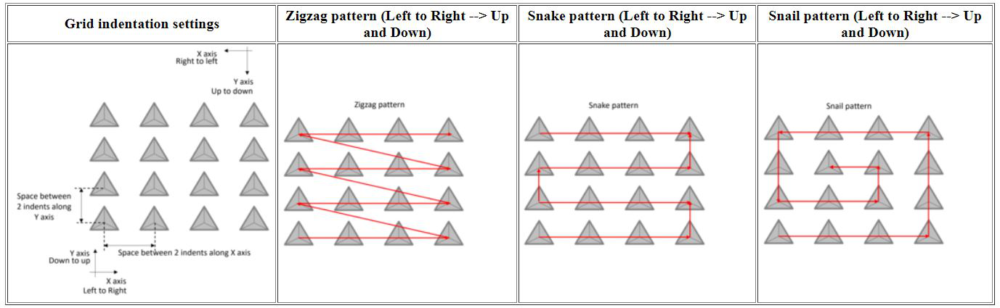
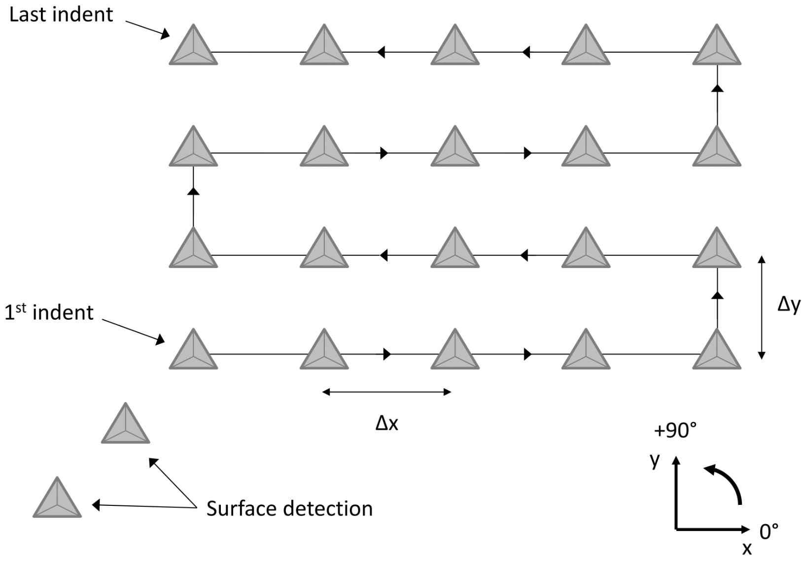

Examples of nanoindentation data
==================================

.. include:: includes.rst

..  warning::
    Only square or rectangular indentation grids can be loaded into the |matlab| toolbox.
	
..  warning::
    Only .xls or .xlsx file can be loaded into the |matlab| toolbox. Or |matlab| code has to be updated. See the section 'New results file' below.
	
..  note::
    For 2D maps, only a sheet with average values at a given indentation depth is enough. But for a 3D mapping, sheet with mechanical properties as a function of indentation depth are required.

File examples from 'MTS/Agilent'
####################################################

For a 2D map: `MTS_example1_25x25.xls <https://github.com/DavidMercier/TriDiMap/blob/master/data_indentation/MTS_example1_25x25.xls>`_
	
For a 3D map: `MTS_example3_5x5_testSlice.xlsx <https://github.com/DavidMercier/NIMS/blob/master/data_indentation/MTS_0film_Si_CSM-2nm_noSD.txt>`_

File example from 'Hysitron'
####################################################

For a 2D map: `Hysitron_example_10x10.xlsx <https://github.com/DavidMercier/TriDiMap/blob/master/data_indentation/Hysitron_example_10x10.xlsx>`_

File example from 'ASMEC'
####################################################

For a 2D map: `ASMEC_example_20x11.xlsx <https://github.com/DavidMercier/TriDiMap/blob/master/data_indentation/ASMEC_example_20x11.xlsx>`_

File example after crop and interpolation steps
####################################################

For a 2D map: `MTS_example1_25x25.xls_interp_81x81.xls <https://github.com/DavidMercier/TriDiMap/blob/master/data_indentation/MTS_example1_25x25.xls_interp_81x81.xls>`_
Don't forget to set 'Agilent' for the equipment, when you load an .xls file generated using the TriDiMap GUI.

New results file
####################################################

In case of other or new experimental results file, the most important is to know the pattern of the indentation grid.
Given below a list of potential indentation patterns: 

   
   *Examples of existing indentation grid patterns*	

For example, the following figure shows the pattern of a typical indentation grid obtained using the software (e.g. Testworks...) of MTS/Agilent.

The |matlab| function to modify to load specific indentation results file is:
`TriDiMap_loadingAllTests.m <https://github.com/DavidMercier/TriDiMap/blob/master/matlab_code/loading_data/TriDiMap_loadingAllTests.m>`_

Contact `me <david9684@gmail.com>`_, in case of special data file format.

   
   *Example of indentation grid pattern using a MTS/Agilent nanoindenter*	
